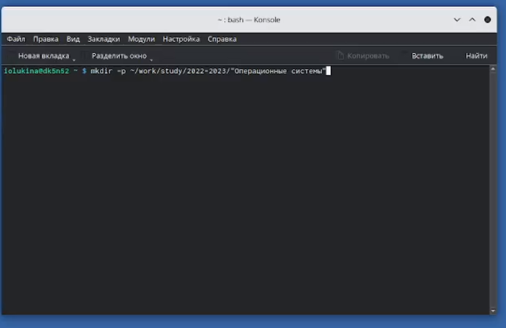
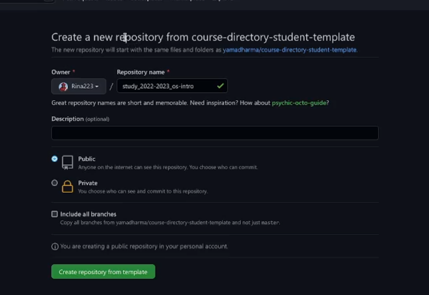
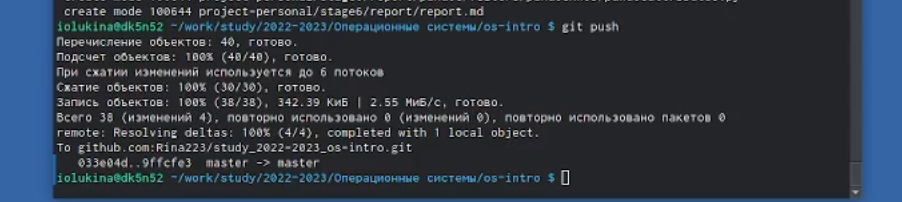

---
## Front matter
lang: ru-RU
title: Отчет по лабораторной работе №2
subtitle: Операционные системы
author:
  - Лукина Р.О.
institute:
  - Российский университет дружбы народов, Москва, Россия


## i18n babel
babel-lang: russian
babel-otherlangs: english

## Formatting pdf
toc: false
toc-title: Содержание
slide_level: 2
aspectratio: 169
section-titles: true
theme: metropolis
header-includes:
 - \metroset{progressbar=frametitle,sectionpage=progressbar,numbering=fraction}
 - '\makeatletter'
 - '\beamer@ignorenonframefalse'
 - '\makeatother'
---

# Информация

## Докладчик

:::::::::::::: {.columns align=center}
::: {.column width="70%"}

  * Лукина Рина Олеговна
  * студентка 1курса 
  

:::
::: {.column width="30%"}


:::
::::::::::::::

# Вводная часть

## Актуальность

- Важно донести результаты своих исследований до окружающих
- Научная презентация --- рабочий инструмент исследователя
- Необходимо создавать презентацию быстро
- Желательна минимизация усилий для создания презентации

## Объект и предмет исследования

- Презентация как текст
- Программное обеспечение для создания презентаций
- Входные и выходные форматы презентаций

## Цели и задачи

- Создать шаблон презентации в Markdown
- Описать алгоритм создания выходных форматов презентаций

## Материалы и методы

- Процессор `pandoc` для входного формата Markdown
- Результирующие форматы
	- `pdf`
	- `html`
- Автоматизация процесса создания: `Makefile`

# Создание презентации

## Создание каталога 

- Я создала каталог для новой дисциплины и перешла в него 


## Репозиторий

- Далее я создала новый репозиторий в GitHub, скопировала ссылку на него и склонировала в каталог



## Настройка каталога курса

- После перехода в каталог os-intro я ввела несколько команд, которые преобразуют его для возможности дальнейшей работы. После отправляю файлы на сервер





## Выводы

- В ходе выполнения работы я смогла создать новый репозиторий и вспомнила как вносить его данные в каталог курса на свою ОС. 


```


## Получающиеся форматы

- Полученный `pdf`-файл можно демонстрировать в любой программе просмотра `pdf`
- Полученный `html`-файл содержит в себе все ресурсы: изображения, css, скрипты

# Элементы презентации

## Актуальность

- Даёт понять, о чём пойдёт речь
- Следует широко и кратко описать проблему
- Мотивировать свое исследование
- Сформулировать цели и задачи
- Возможна формулировка ожидаемых результатов

## Цели и задачи

- Не формулируйте более 1--2 целей исследования

## Материалы и методы

- Представляйте данные качественно
- Количественно, только если крайне необходимо
- Излишние детали не нужны

## Содержание исследования

- Предлагаемое решение задач исследования с обоснованием
- Основные этапы работы

## Результаты

- Не нужны все результаты
- Необходимы логические связки между слайдами
- Необходимо показать понимание материала


## Итоговый слайд

- Запоминается последняя фраза. © Штирлиц
- Главное сообщение, которое вы хотите донести до слушателей
- Избегайте использовать последний слайд вида *Спасибо за внимание*

# Рекомендации

## Принцип 10/20/30

  - 10 слайдов
  - 20 минут на доклад
  - 30 кегль шрифта

## Связь слайдов

::: incremental

- Один слайд --- одна мысль
- Нельзя ссылаться на объекты, находящиеся на предыдущих слайдах (например, на формулы)
- Каждый слайд должен иметь заголовок

:::

## Количество сущностей

::: incremental

- Человек может одновременно помнить $7 \pm 2$ элемента
- При размещении информации на слайде старайтесь чтобы в сумме слайд содержал не более 5 элементов
- Можно группировать элементы так, чтобы визуально было не более 5 групп

:::

## Общие рекомендации

::: incremental

- На слайд выносится та информация, которая без зрительной опоры воспринимается хуже
- Слайды должны дополнять или обобщать содержание выступления или его частей, а не дублировать его
- Информация на слайдах должна быть изложена кратко, чётко и хорошо структурирована
- Слайд не должен быть перегружен графическими изображениями и текстом
- Не злоупотребляйте анимацией и переходами

:::

## Представление данных

::: incremental

- Лучше представить в виде схемы
- Менее оптимально представить в виде рисунка, графика, таблицы
- Текст используется, если все предыдущие способы отображения информации не подошли

:::

