---
## Front matter
title: "Отчет по лабораторной работе №4"
subtitle: "Операционные системы"
author: "Лукина Рина"

## Generic otions
lang: ru-RU
toc-title: "Содержание"

## Bibliography
bibliography: bib/cite.bib
csl: pandoc/csl/gost-r-7-0-5-2008-numeric.csl

## Pdf output format
toc: true # Table of contents
toc-depth: 2
lof: true # List of figures
lot: true # List of tables
fontsize: 12pt
linestretch: 1.5
papersize: a4
documentclass: scrreprt
## I18n polyglossia
polyglossia-lang:
  name: russian
  options:
	- spelling=modern
	- babelshorthands=true
polyglossia-otherlangs:
  name: english
## I18n babel
babel-lang: russian
babel-otherlangs: english
## Fonts
mainfont: PT Serif
romanfont: PT Serif
sansfont: PT Sans
monofont: PT Mono
mainfontoptions: Ligatures=TeX
romanfontoptions: Ligatures=TeX
sansfontoptions: Ligatures=TeX,Scale=MatchLowercase
monofontoptions: Scale=MatchLowercase,Scale=0.9
## Biblatex
biblatex: true
biblio-style: "gost-numeric"
biblatexoptions:
  - parentracker=true
  - backend=biber
  - hyperref=auto
  - language=auto
  - autolang=other*
  - citestyle=gost-numeric
## Pandoc-crossref LaTeX customization
figureTitle: "Рис."
tableTitle: "Таблица"
listingTitle: "Листинг"
lofTitle: "Список иллюстраций"
lotTitle: "Список таблиц"
lolTitle: "Листинги"
## Misc options
indent: true
header-includes:
  - \usepackage{indentfirst}
  - \usepackage{float} # keep figures where there are in the text
  - \floatplacement{figure}{H} # keep figures where there are in the text
---

# Цель работы

Целью работы является приобретение практических навыков взаимодействия пользователя с системой посредством командной строки.

# Выполнение лабораторной работы

1. Определяю полное имя домашнего каталога через pwd. 

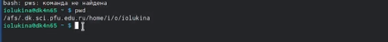{#fig:001 width=90%}

2. Перехожу в каталог tmp. Проверяю его содержимое. Опции ls.
 1) ls -l - подробная информация о каждом файле и каталоге;
 2) ls -a - выявление скрытых файлов.

{#fig:002 width=90%}

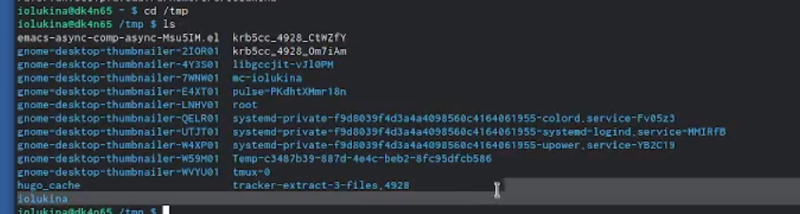{#fig:003 width=90%}

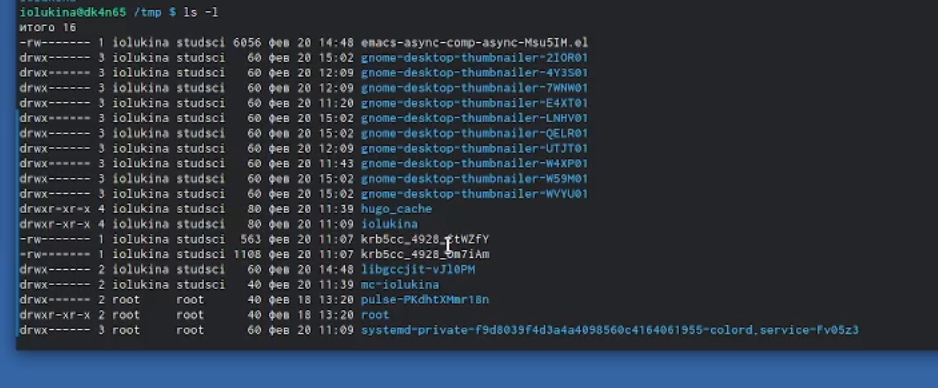{#fig:004 width=90%}

{#fig:005 width=90%}

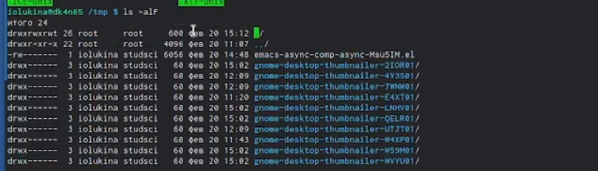{#fig:006 width=90%}

3. Проверяю каталог spool на наличие каталога cron.

{#fig:007 width=90%}

4. Перехожу в домашний каталог и вывожу его содержимое.

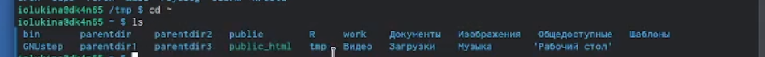{#fig:008 width=90%}

5. Команда mkdir. Создаю каталог newdir и проверяю его, а затем в нем каталог morefun.

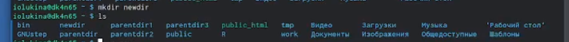{#fig:009 width=90%}

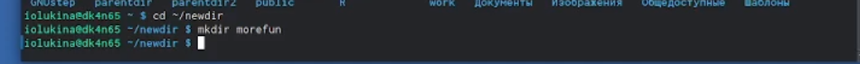{#fig:010 width=90%}

6. Создаю одной командой три новых каталога и проверяю их наличие.

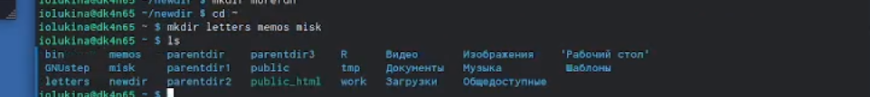{#fig:011 width=90%}

7. Удаляю каталог newdir. После его удаления удален также и morefun.

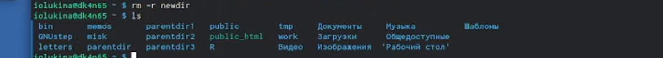{#fig:012 width=90%}

8. Опции ls.

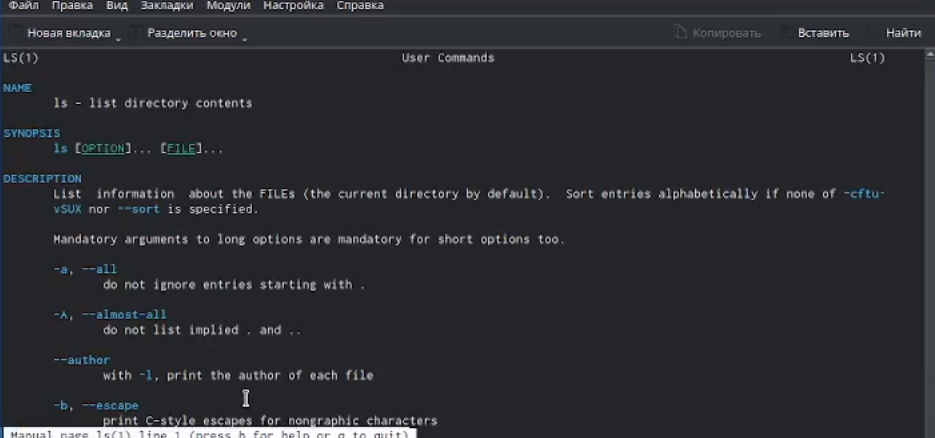{#fig:013 width=90%}

9. man cd,pwd,mkdir,rmdir,rm.

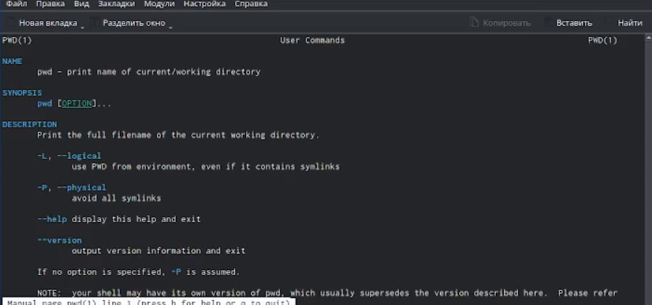{#fig:014 width=90%}

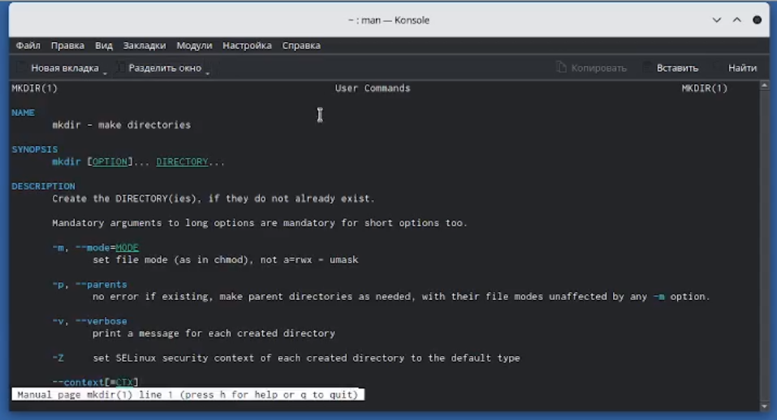{#fig:015 width=90%}

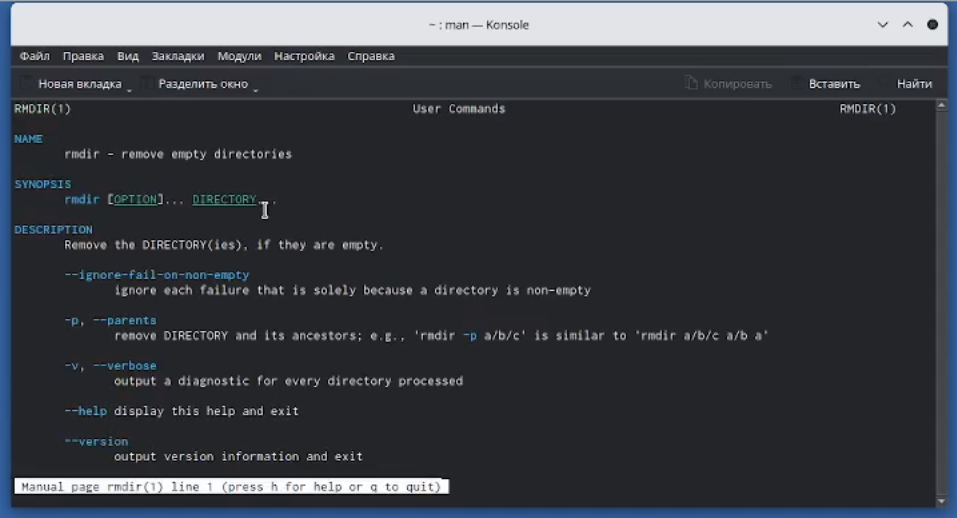{#fig:016 width=90%}

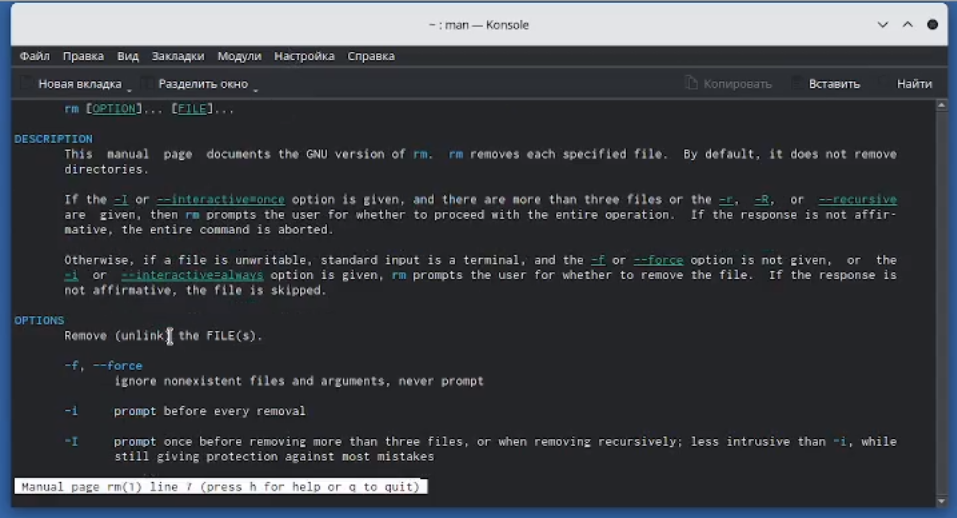{#fig:017 width=90%}

10. Ввожу команду history и вижу ряд выполнимых ранее команд. С помощью команды !№:s/../.. меняю одну на другую.

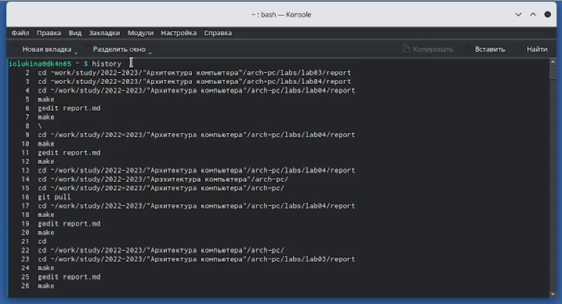{#fig:018 width=90%}

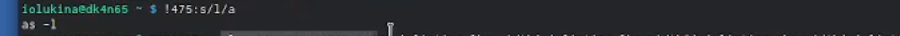{#fig:019 width=90%}

# Выводы

Здесь кратко описываются итоги проделанной работы.

# Список литературы{.unnumbered}

::: {#refs}
:::
