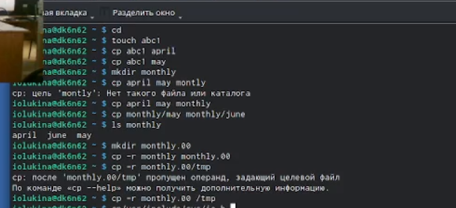
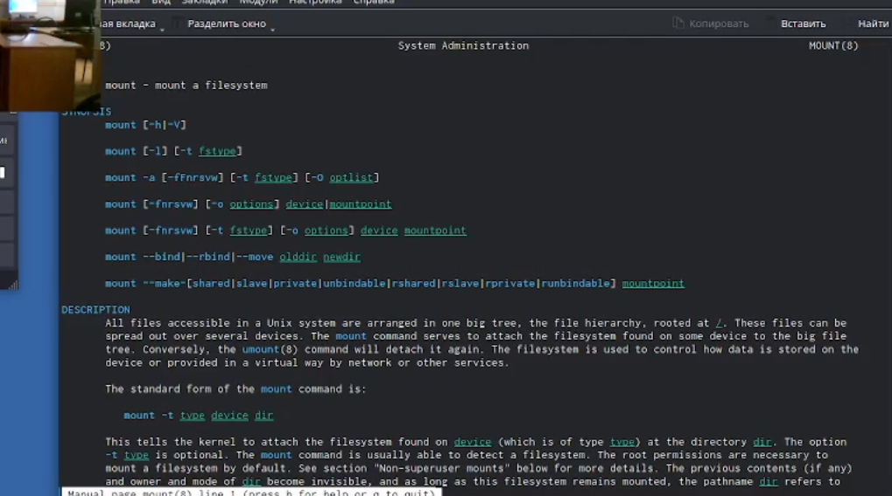
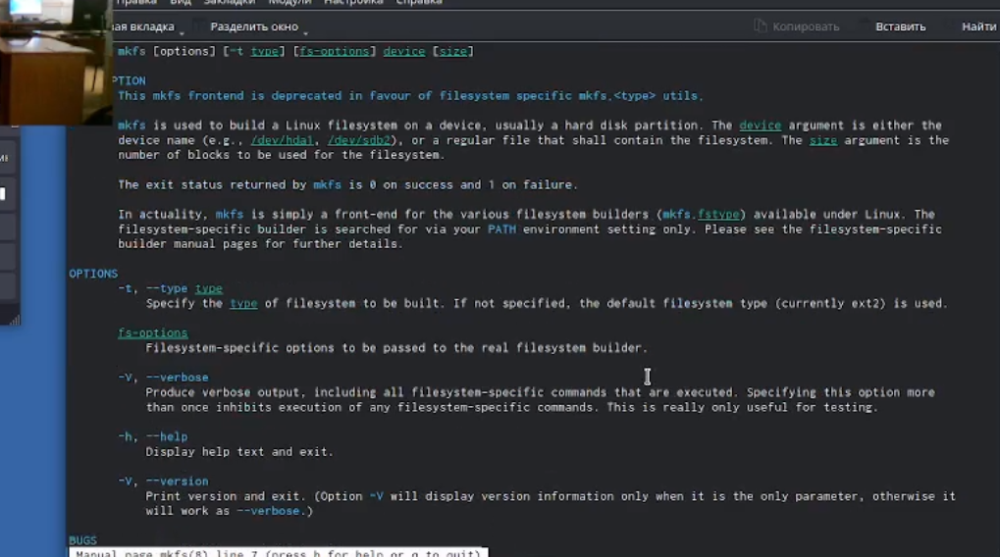
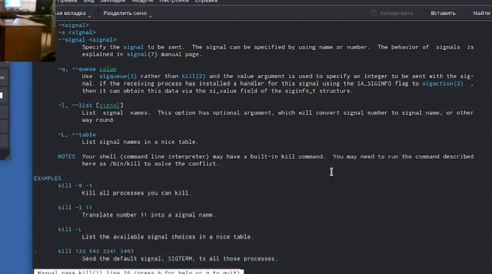

---
## Front matter
lang: ru-RU
title: Отчет по лабораторной работе №5
subtitle: Операционные системы
author:
  - Лукина Р.О.
institute:
  - Российский университет дружбы народов, Москва, Россия
 

## i18n babel
babel-lang: russian
babel-otherlangs: english

## Formatting pdf
toc: false
toc-title: Содержание
slide_level: 2
aspectratio: 169
section-titles: true
theme: metropolis
header-includes:
 - \metroset{progressbar=frametitle,sectionpage=progressbar,numbering=fraction}
 - '\makeatletter'
 - '\beamer@ignorenonframefalse'
 - '\makeatother'
---

# Информация

## Докладчик

:::::::::::::: {.columns align=center}
::: {.column width="70%"}

  * Лукина Рина Олеговна

:::
::: {.column width="30%"}

:::
::::::::::::::

# Вводная часть

## Цели и задачи

Ознакомление с файловой системой Linux, ее структурой , именами и содержа-
нием каталогов. Приобретение практических навыков по применению команд
для работы с файлами и каталогами, по управлению процессами (и работами),
по проверке использования диска и обслуживанию файловой системы.

# Создание презентации

## Выполнение примеров

- Сначала выполняю примеры. данные в теоретической части.

## Командa cp 

- Копирую каталог

## Команда mv

- Перемещаю файл в каталог

## Файл abc1

- Создаю новый файл и копирую его с новым именем

## Перемещение файлов
- Создаю новый каталог и перемещаю файлы.

##chmod

- Создаю новые файлы и определяю опции команды chmod.
![chmod(./image/10.png)

- Лишаю владельца права на чтение.

## man 
- Просмотр опций команд.

## Опции команд 
 mounth нужна для просмота смонтированных файловых систем, а также для монтирования любых локальных или удаленных файловых систем.
 mkfs создает файловые системы.
 kill завершает некорректно работающее приложение.
 

# Результаты

# Рекомендации

## Принцип 10/20/30

  - 10 слайдов
  - 20 минут на доклад
  - 30 кегль шрифта

## Связь слайдов

::: incremental

- Один слайд --- одна мысль
- Нельзя ссылаться на объекты, находящиеся на предыдущих слайдах (например, на формулы)
- Каждый слайд должен иметь заголовок

:::

## Количество сущностей

::: incremental

- Человек может одновременно помнить $7 \pm 2$ элемента
- При размещении информации на слайде старайтесь чтобы в сумме слайд содержал не более 5 элементов
- Можно группировать элементы так, чтобы визуально было не более 5 групп

:::

## Общие рекомендации

::: incremental

- На слайд выносится та информация, которая без зрительной опоры воспринимается хуже
- Слайды должны дополнять или обобщать содержание выступления или его частей, а не дублировать его
- Информация на слайдах должна быть изложена кратко, чётко и хорошо структурирована
- Слайд не должен быть перегружен графическими изображениями и текстом
- Не злоупотребляйте анимацией и переходами

:::

## Представление данных

::: incremental

- Лучше представить в виде схемы
- Менее оптимально представить в виде рисунка, графика, таблицы
- Текст используется, если все предыдущие способы отображения информации не подошли

:::

