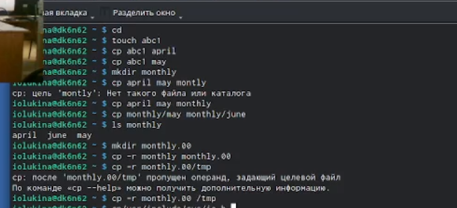
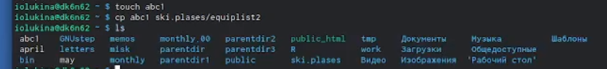
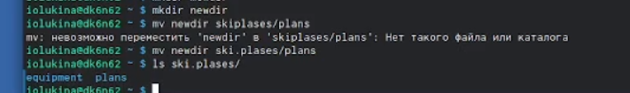
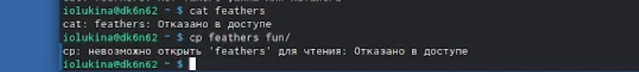
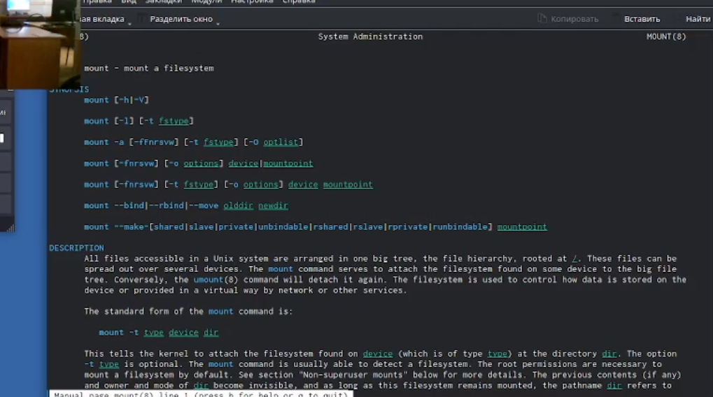
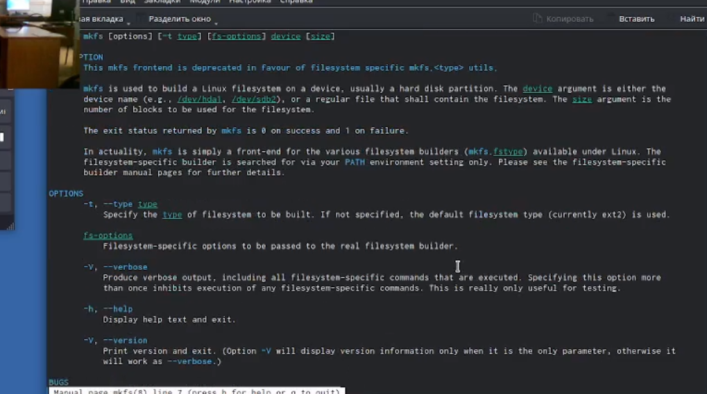
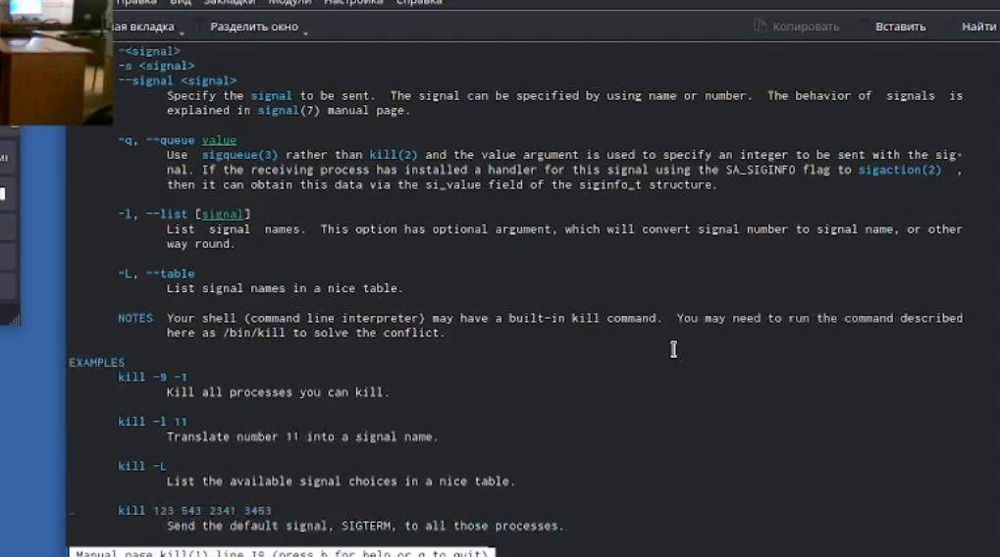

---
## Front matter
title: "Отчет по лабораторной работе №5"
subtitle: "Операционные системы"
author: "Лукина Ирина Олеговна"

## Generic otions
lang: ru-RU
toc-title: "Содержание"

## Bibliography
bibliography: bib/cite.bib
csl: pandoc/csl/gost-r-7-0-5-2008-numeric.csl

## Pdf output format
toc: true # Table of contents
toc-depth: 2
lof: true # List of figures
lot: true # List of tables
fontsize: 12pt
linestretch: 1.5
papersize: a4
documentclass: scrreprt
## I18n polyglossia
polyglossia-lang:
  name: russian
  options:
	- spelling=modern
	- babelshorthands=true
polyglossia-otherlangs:
  name: english
## I18n babel
babel-lang: russian
babel-otherlangs: english
## Fonts
mainfont: PT Serif
romanfont: PT Serif
sansfont: PT Sans
monofont: PT Mono
mainfontoptions: Ligatures=TeX
romanfontoptions: Ligatures=TeX
sansfontoptions: Ligatures=TeX,Scale=MatchLowercase
monofontoptions: Scale=MatchLowercase,Scale=0.9
## Biblatex
biblatex: true
biblio-style: "gost-numeric"
biblatexoptions:
  - parentracker=true
  - backend=biber
  - hyperref=auto
  - language=auto
  - autolang=other*
  - citestyle=gost-numeric
## Pandoc-crossref LaTeX customization
figureTitle: "Рис."
tableTitle: "Таблица"
listingTitle: "Листинг"
lofTitle: "Список иллюстраций"
lotTitle: "Список таблиц"
lolTitle: "Листинги"
## Misc options
indent: true
header-includes:
  - \usepackage{indentfirst}
  - \usepackage{float} # keep figures where there are in the text
  - \floatplacement{figure}{H} # keep figures where there are in the text
---

# Цель работы

Ознакомление с файловой системой Linux, ее структурой , именами и содержанием каталогов. Приобретение практических навыков по применению команд для работы с файлами и каталогами, по управлению процессами (и работами), по проверке использования диска и обслуживанию файловой системы.

# Выполнение лабораторной работы

1. Выполняю примеры команд согласно ходу выполнения работы.

{#fig:001 width=90%}

2. Копирую файл и даю ему название через команду cp.

{#fig:002 width=90%}

3. Создаю директорию через mksdir.

{#fig:003 width=90%}

4. Перемещаю файл в каталог командой mv и проверяю.

{#fig:004 width=90%}

5. Создаю новый файл и копирую его в каталог, одновременно даю новое название.

{#fig:005 width=90%}

6. Создаю новый каталог в ski.plases/

{#fig:006 width=90%}

7. Перемещаю файлы.

{#fig:007 width=90%}

8. Создаю каталог newdir и перемещаю, дав новое имя.

{#fig:008 width=90%}

9. Создаю новые файлы и определяю опции команды chmod.

{#fig:009 width=90%}

10. Копирую файл в другой файл.

{#fig:010 width=90%}

11. Перемещаю каталог play в fun.

{#fig:011 width=90%}

12. Создаю каталог fun и перемещаю его.

{#fig:012 width=90%}

13. Перемещаю в каталог play и даю название games.

{#fig:013 width=90%}

14. Лишаю владельца файла права на чтение.

{#fig:014 width=90%}

15. Через команду cat пробую проверить feathers.

{#fig:015 width=90%}

16. Пробую скопировать.

{#fig:016 width=90%}

17. Лишаю права на просмотр каталога play.

{#fig:017 width=90%}

18. Просматриваю разные опции команд через man.

{#fig:018 width=90%}

{#fig:019 width=90%}

{#fig:020 width=90%}

# Выводы

В ходе выполнения работы я приобрела практические навыки в работе с файловой системой Linux.

# Список литературы{.unnumbered}

::: {#refs}
:::
