---
## Front matter
title: "Отчет по лабораторной работе №6"
subtitle: "Операционные системы"
author: "Лукина Ирина Олеговна"

## Generic otions
lang: ru-RU
toc-title: "Содержание"

## Bibliography
bibliography: bib/cite.bib
csl: pandoc/csl/gost-r-7-0-5-2008-numeric.csl

## Pdf output format
toc: true # Table of contents
toc-depth: 2
lof: true # List of figures
lot: true # List of tables
fontsize: 12pt
linestretch: 1.5
papersize: a4
documentclass: scrreprt
## I18n polyglossia
polyglossia-lang:
  name: russian
  options:
	- spelling=modern
	- babelshorthands=true
polyglossia-otherlangs:
  name: english
## I18n babel
babel-lang: russian
babel-otherlangs: english
## Fonts
mainfont: PT Serif
romanfont: PT Serif
sansfont: PT Sans
monofont: PT Mono
mainfontoptions: Ligatures=TeX
romanfontoptions: Ligatures=TeX
sansfontoptions: Ligatures=TeX,Scale=MatchLowercase
monofontoptions: Scale=MatchLowercase,Scale=0.9
## Biblatex
biblatex: true
biblio-style: "gost-numeric"
biblatexoptions:
  - parentracker=true
  - backend=biber
  - hyperref=auto
  - language=auto
  - autolang=other*
  - citestyle=gost-numeric
## Pandoc-crossref LaTeX customization
figureTitle: "Рис."
tableTitle: "Таблица"
listingTitle: "Листинг"
lofTitle: "Список иллюстраций"
lotTitle: "Список таблиц"
lolTitle: "Листинги"
## Misc options
indent: true
header-includes:
  - \usepackage{indentfirst}
  - \usepackage{float} # keep figures where there are in the text
  - \floatplacement{figure}{H} # keep figures where there are in the text
---

# Цель работы

Ознакомление с инструментами поиска файлов и фильтрации текстовых данных. Приобретение практических навыков: пл управлению процессами (и заданиями), по проверке использования диска и обслуживанию файловых систем.
# Выполнение лабораторной работы
1. Вхожу в систему.

2. Записываю в файл названия файлов, содержащихся в домашнем каталоге.

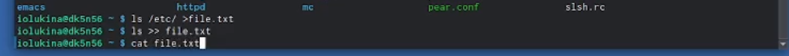{#fig:001 width=70%}

3. Вывожу имена всех файлов, имеющих расширение .conf.

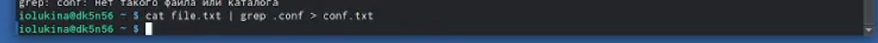{#fig:002 width=70%}

4. Несколькими способами определяю какие файлы начинаются с "с".

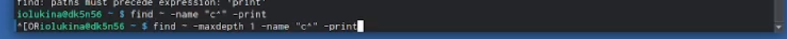{#fig:003 width=70%}

5. Через find вывожу имена файлов из каталог, начинающиеся в символа "h".

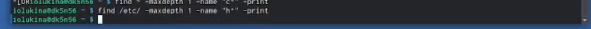{#fig:004 width=70%}

6. Запускаю в фоновом режиме процесс, который будет записывать в файл файлы, начинающиеся с определенных символов.

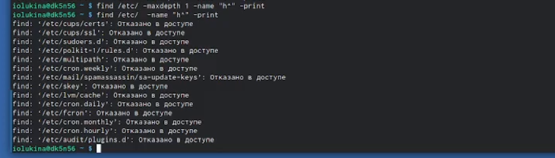{#fig:005 width=70%}

7. Удаляю файл.

{#fig:007 width=70%}

8. Запускаю в фоновом режиме gedit.

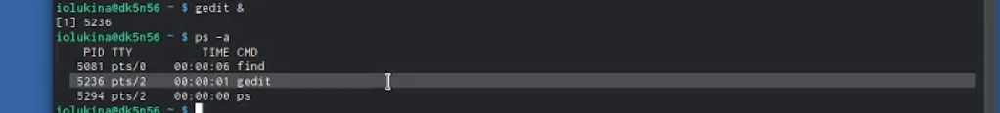{#fig:008 width=70%}

9. Определяю индентификатор gedit через ps. 

{#fig:009 width=70%}

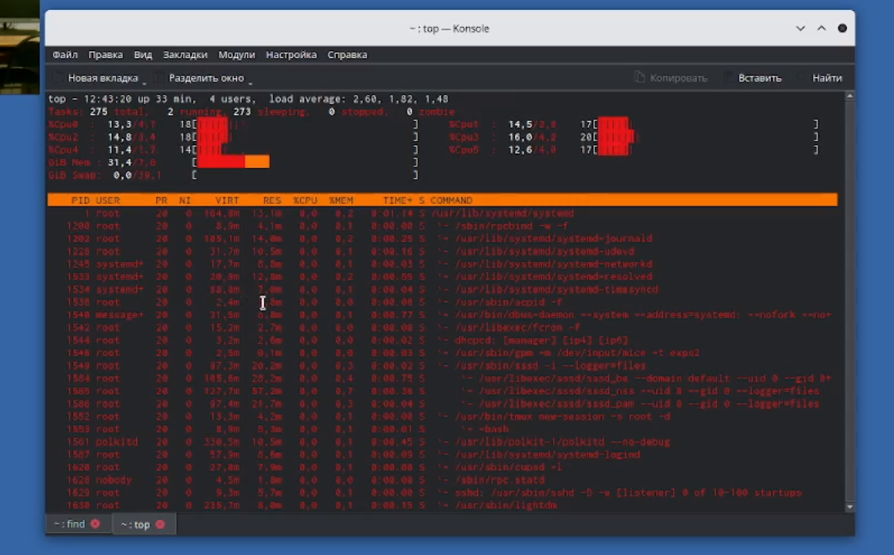{#fig:010 width=70%}

{#fig:011 width=70%}

10. Открываю справку по команду kill и завершаю gedit, вписывая номер индентификатора.

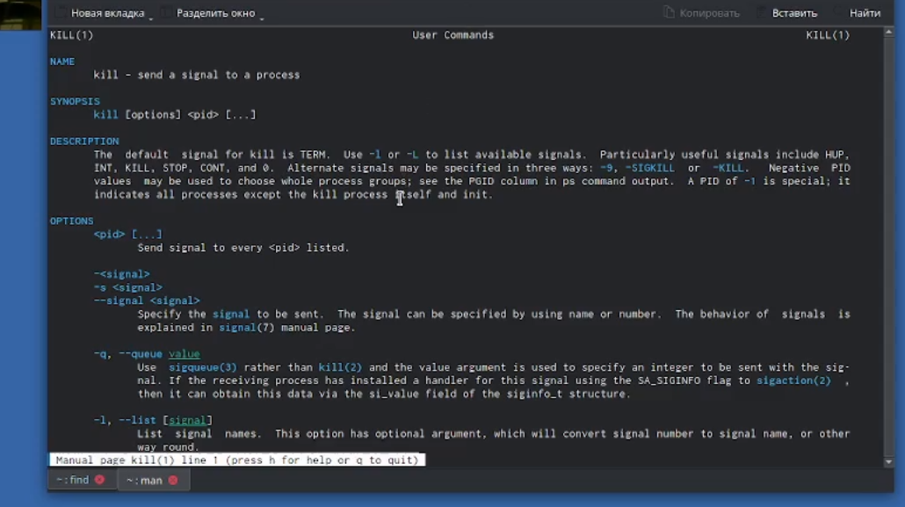{#fig:012 width=70%}

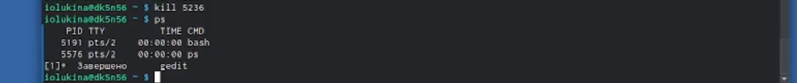{#fig:013 width=70%}

11. Выполняю команды df и du. Открываю справку по ним.

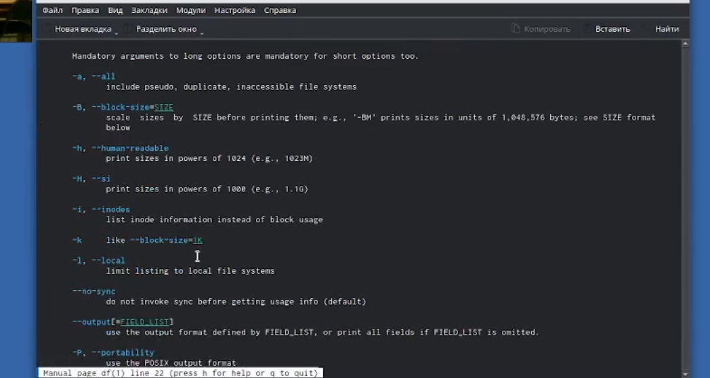{#fig:014 width=70%}

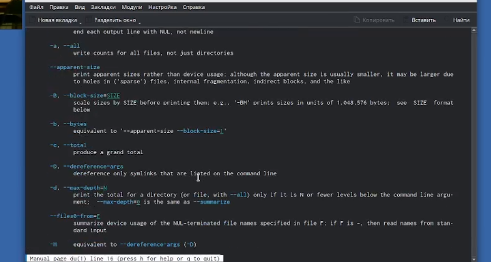{#fig:015 width=70%}

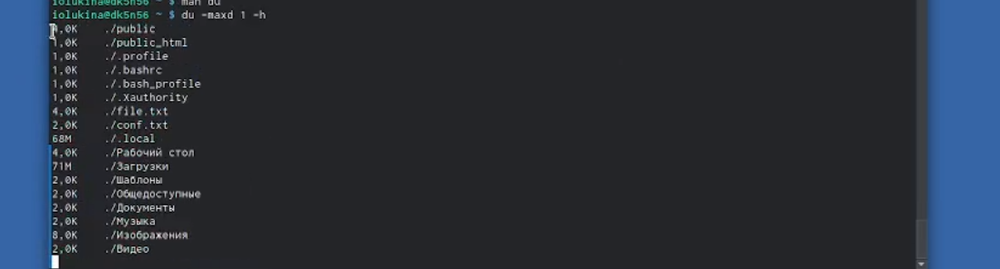{#fig:016 width=70%}

12. С помощью find выводу имена всех директорий из домашнего каталога.

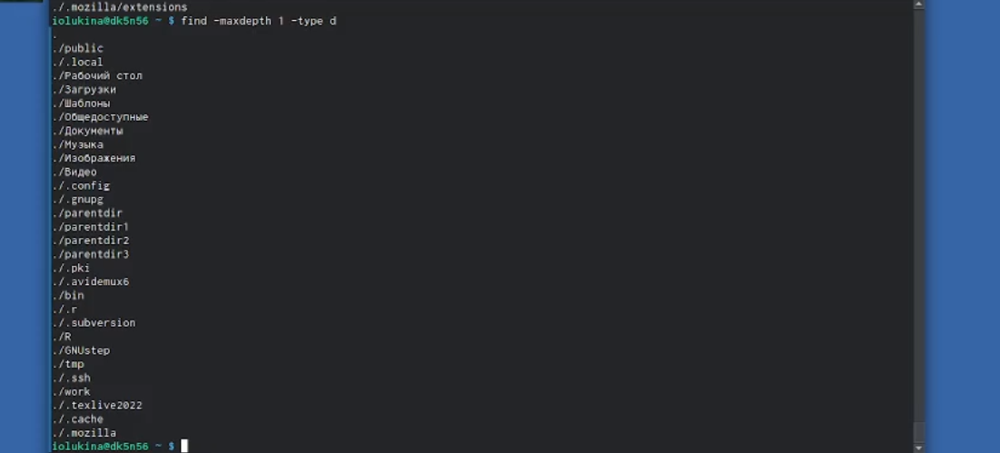{#fig:017 width=70%}
# Выводы

В ходе выполнения лабораторной работы я научилась находить и перенаправлять файлы через консоль.

