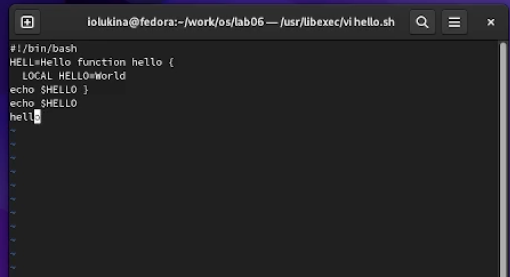
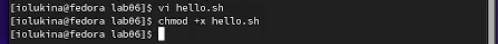
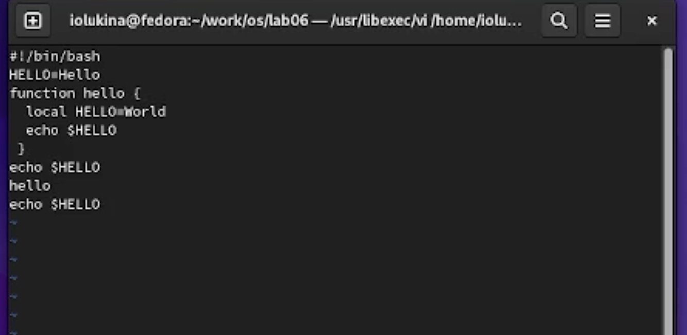
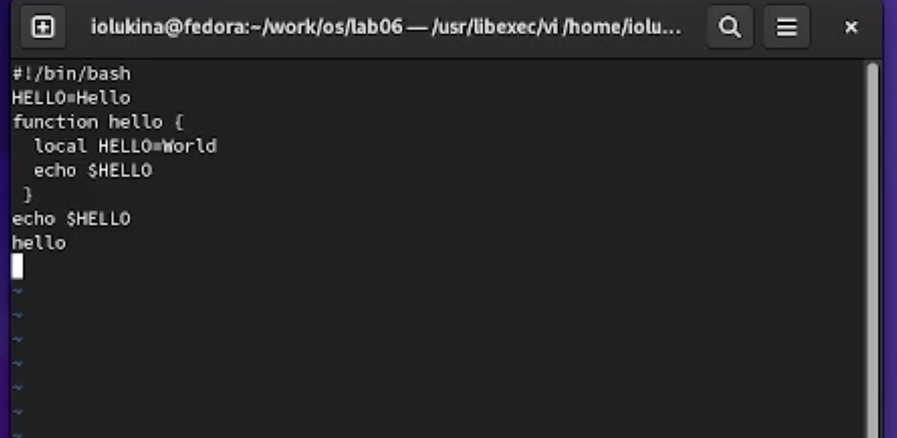

---
## Front matter
lang: ru-RU
title: Отчет по лабораторной работе №8
subtitle: Операционные системы
author:
  - Лукина Р.О.
institute:
  - Российский университет дружбы народов, Москва, Россия
date: 31 марта 2023

## i18n babel
babel-lang: russian
babel-otherlangs: english

## Formatting pdf
toc: false
toc-title: Содержание
slide_level: 2
aspectratio: 169
section-titles: true
theme: metropolis
header-includes:
 - \metroset{progressbar=frametitle,sectionpage=progressbar,numbering=fraction}
 - '\makeatletter'
 - '\beamer@ignorenonframefalse'
 - '\makeatother'
---

# Информация о выступающем

## Докладчица

:::::::::::::: {.columns align=center}
::: {.column width="70%"}

  * Лукина Ирина Олеговна
  * студентка НБИ-04-22

:::
::: {.column width="30%"}

:::
::::::::::::::

# Вводная часть

## Цели и задачи

- Получить практические навыки в работе с текстовым редактором Vi

# Выполнение работы

## Создание каталога

- Создаю каталог и открываю в нем редактор

## Текст

- Ввожу указанный текст в созданный файл, делаю запись и выхожу

## CHMOD

- Делаю файл исполняемым

## Редактирование

- Открываю файл для дальнейшего редактирования

- Изменяю текст согласно указаниям в работе

# Заключение

## Выводы

- В ходе выполнения работы я научилась работать с текстовым редактором vi

