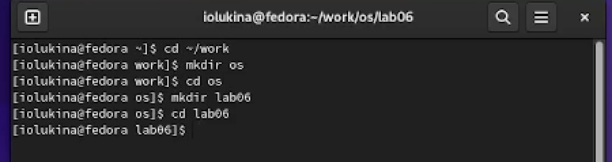
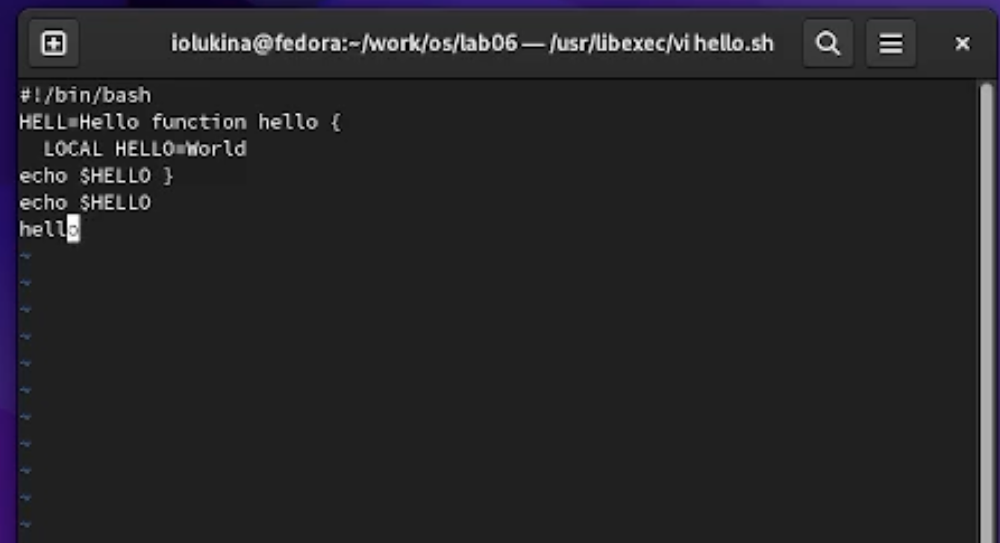
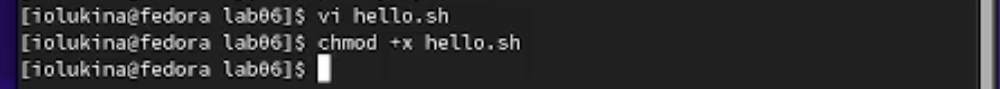
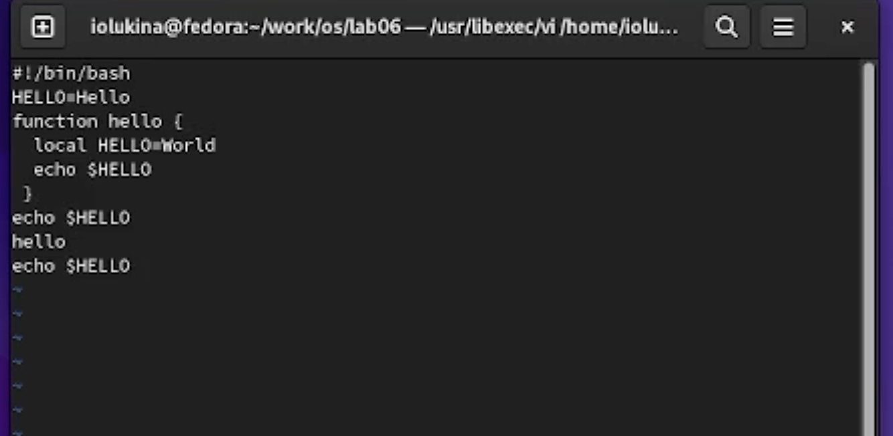
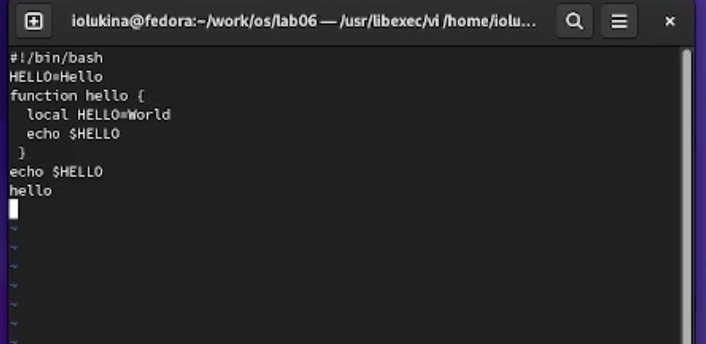

---
## Front matter
title: "Отчет по лабораторной работе №8"
subtitle: "Операционные системы"
author: "Ирина Олеговна Лукина"

## Generic otions
lang: ru-RU
toc-title: "Содержание"

## Bibliography
bibliography: bib/cite.bib
csl: pandoc/csl/gost-r-7-0-5-2008-numeric.csl

## Pdf output format
toc: true # Table of contents
toc-depth: 2
lof: true # List of figures
lot: true # List of tables
fontsize: 12pt
linestretch: 1.5
papersize: a4
documentclass: scrreprt
## I18n polyglossia
polyglossia-lang:
  name: russian
  options:
	- spelling=modern
	- babelshorthands=true
polyglossia-otherlangs:
  name: english
## I18n babel
babel-lang: russian
babel-otherlangs: english
## Fonts
mainfont: PT Serif
romanfont: PT Serif
sansfont: PT Sans
monofont: PT Mono
mainfontoptions: Ligatures=TeX
romanfontoptions: Ligatures=TeX
sansfontoptions: Ligatures=TeX,Scale=MatchLowercase
monofontoptions: Scale=MatchLowercase,Scale=0.9
## Biblatex
biblatex: true
biblio-style: "gost-numeric"
biblatexoptions:
  - parentracker=true
  - backend=biber
  - hyperref=auto
  - language=auto
  - autolang=other*
  - citestyle=gost-numeric
## Pandoc-crossref LaTeX customization
figureTitle: "Рис."
tableTitle: "Таблица"
listingTitle: "Листинг"
lofTitle: "Список иллюстраций"
lotTitle: "Список таблиц"
lolTitle: "Листинги"
## Misc options
indent: true
header-includes:
  - \usepackage{indentfirst}
  - \usepackage{float} # keep figures where there are in the text
  - \floatplacement{figure}{H} # keep figures where there are in the text
---

# Цель работы

Целью работы является получение практических навыков работы с редактором vi (установлен по умолчанию почти во всех дистрибутивах)

# Выполнение лабораторной работы

1. Знакомлюсь с теорией и редактором.

2. Создаю каталог os/lab06 и вызываю редактор, создавая в нем файл hello.sh

{#fig:001 width=70%}

{#fig:002 width=70%}

3. Нажимаю клавишу i и ввожу текст

{#fig:003 width=70%}

4. Нажимаю клавишу для перехода в командный режим, затем ввожу :, делаю запись с помощью w и выхожу нажав q

5. Делаю файл исполняыемым, вводя следующую команду:

{#fig:004 width=70%}

6. Вызываю Ви для редактирования файла

{#fig:005 width=70%}

7. Выполняю указанные действия 

{#fig:006 width=70%}

8. Стираю последнюю строку и выхожу из редактора

{#fig:007 width=70%}

# Выводы

В ходе выполнения работы я научилась работать со встроенным редактором vi.

# Список литературы{.unnumbered}

::: {#refs}
:::
