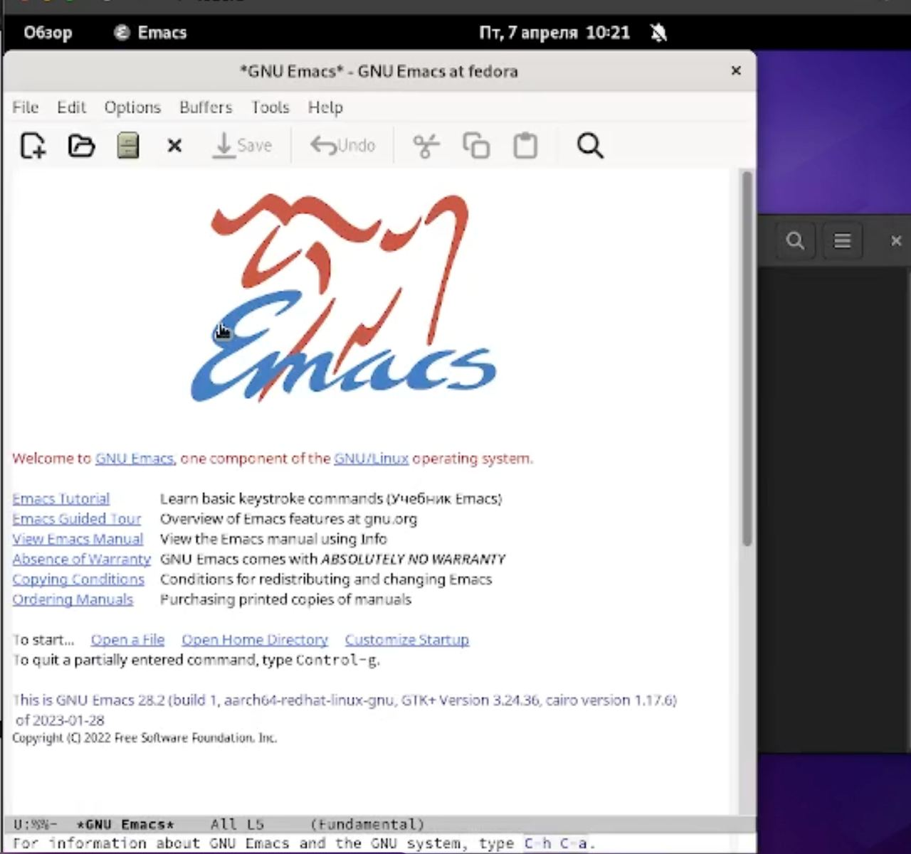
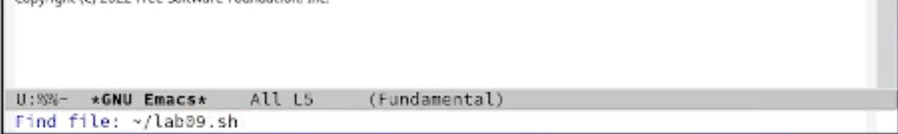
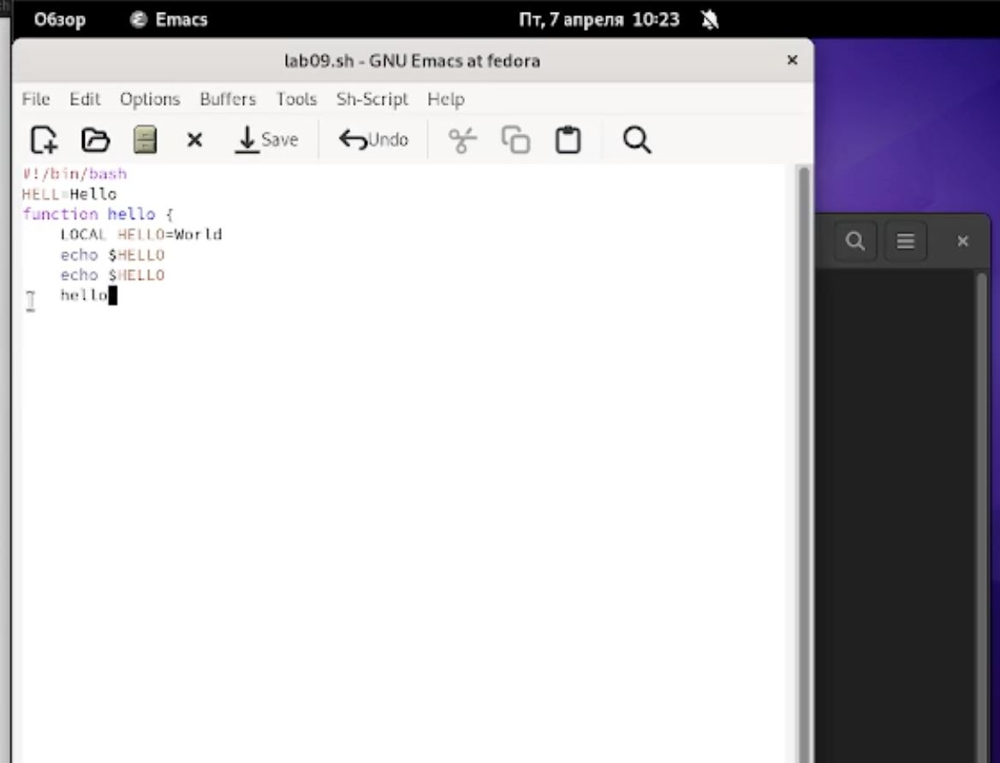
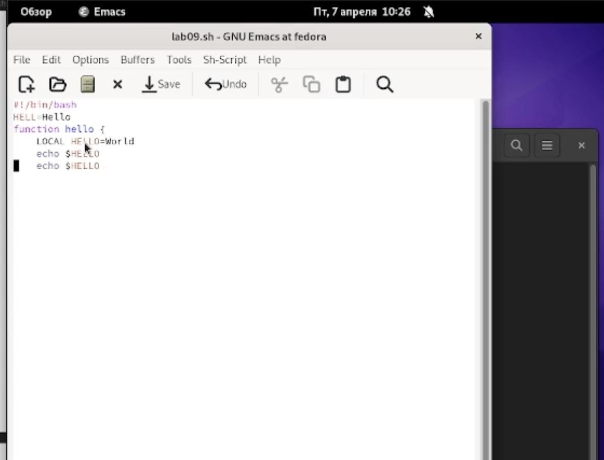
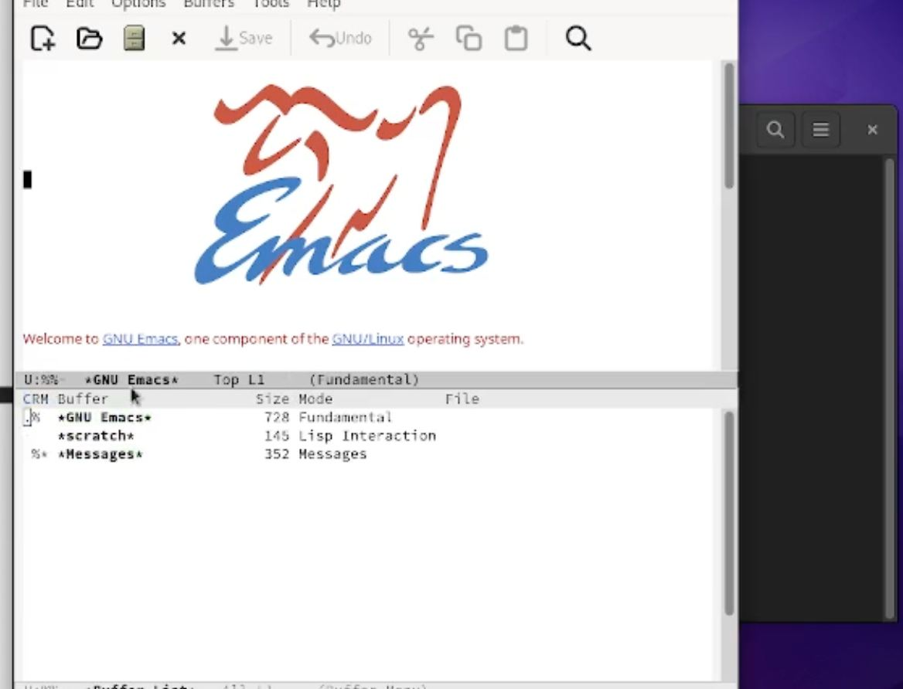
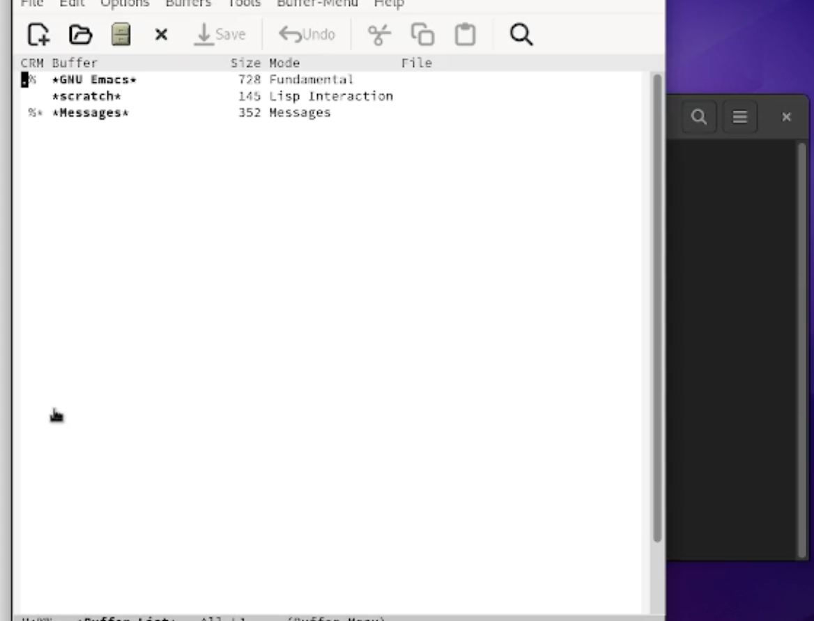
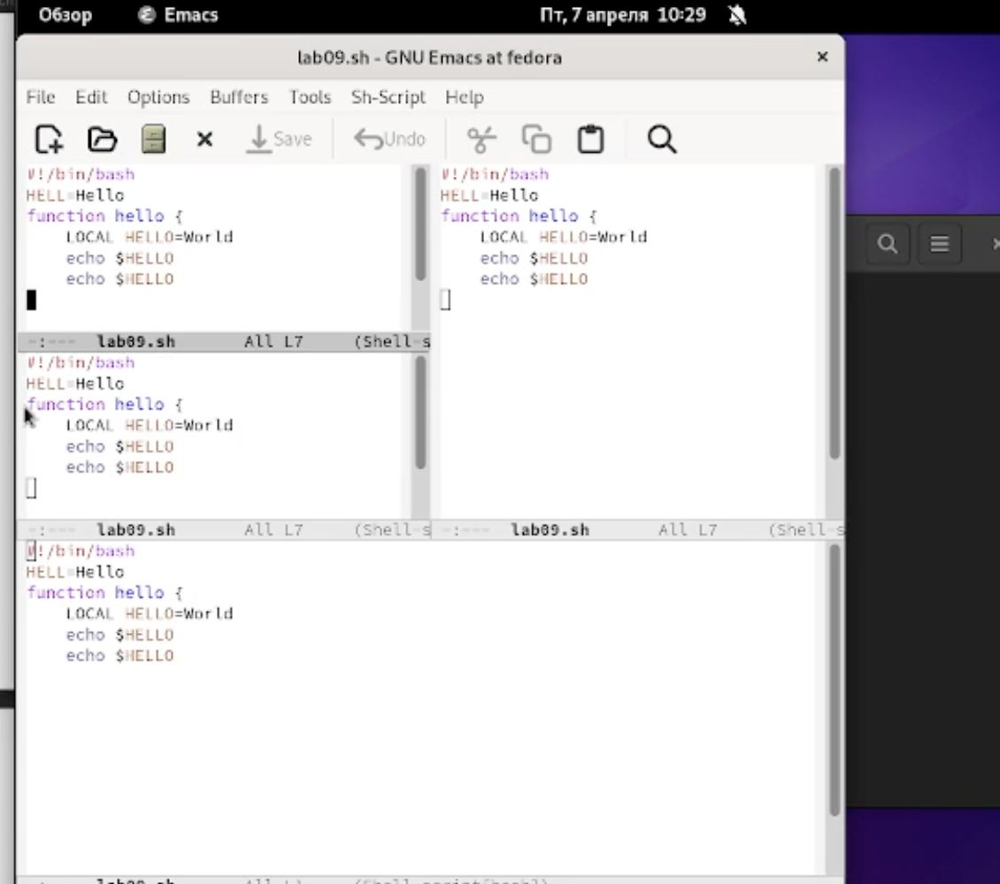
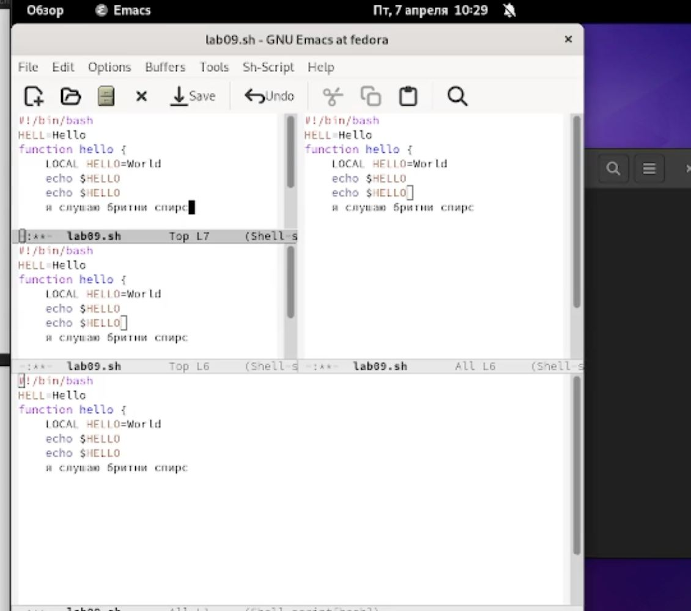

---
## Front matter
lang: ru-RU
title: Отчет по лабораторной работе №9
subtitle: Операционные системы
author:
  - Лукина Р.О..
institute:
  - Российский университет дружбы народов, Москва, Россия
date: 07 апреля 2023

## i18n babel
babel-lang: russian
babel-otherlangs: english

## Formatting pdf
toc: false
toc-title: Содержание
slide_level: 2
aspectratio: 169
section-titles: true
theme: metropolis
header-includes:
 - \metroset{progressbar=frametitle,sectionpage=progressbar,numbering=fraction}
 - '\makeatletter'
 - '\beamer@ignorenonframefalse'
 - '\makeatother'
---

# Информация

## Докладчица

:::::::::::::: {.columns align=center}
::: {.column width="70%"}

  * Лукина Рина Олеговна
  * студентка НБИ-04-22

:::
::: {.column width="30%"}


:::
::::::::::::::

# Вводная часть

## Цели и задачи

- Познакомиться с текстовым редактором Emacs  и получить навыки работы с ним


# Ход работы

## Редактор Emacs

- установка редактора, открытие


##  Создание файла

- Создаю новый файл и ввожу в него текст



## Работа с редактором

- Перемещение файлов, копирование, удаление, работа с курсором



## Работа с буферами

- Ввожу комбинацию для проверки действующих буферов и переключаюсь между ними



## Управление окнами

- Делю фрейм на 4 окна, ввожу текст и работаю с поиском слов



```make
REVEALJS_THEME = beige 
```
## Выводы

- В ходе выполнения работы я научилась работать с редактором Emacs.


