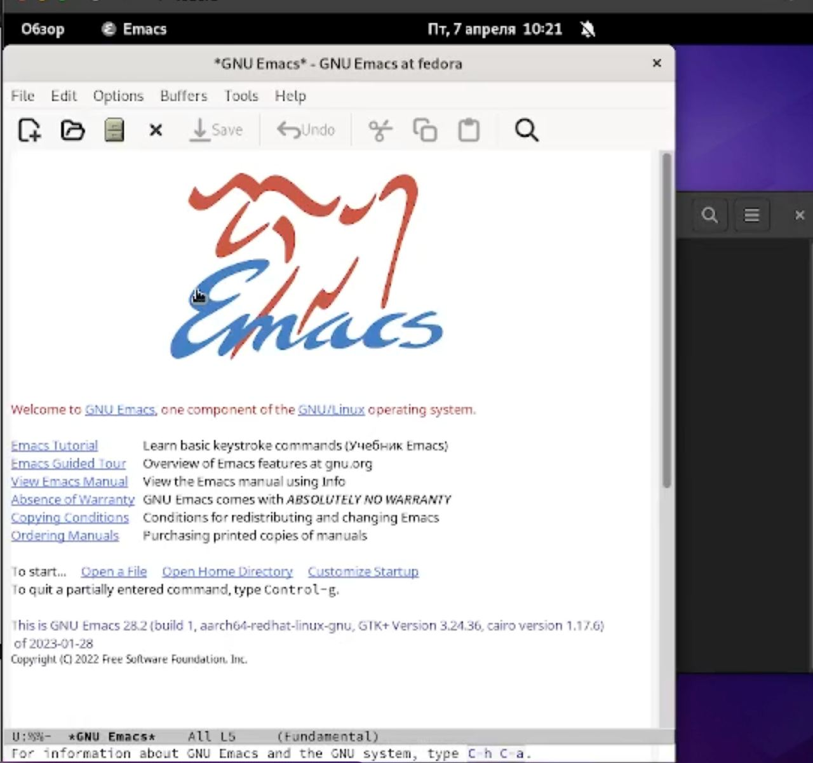
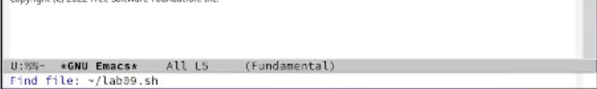
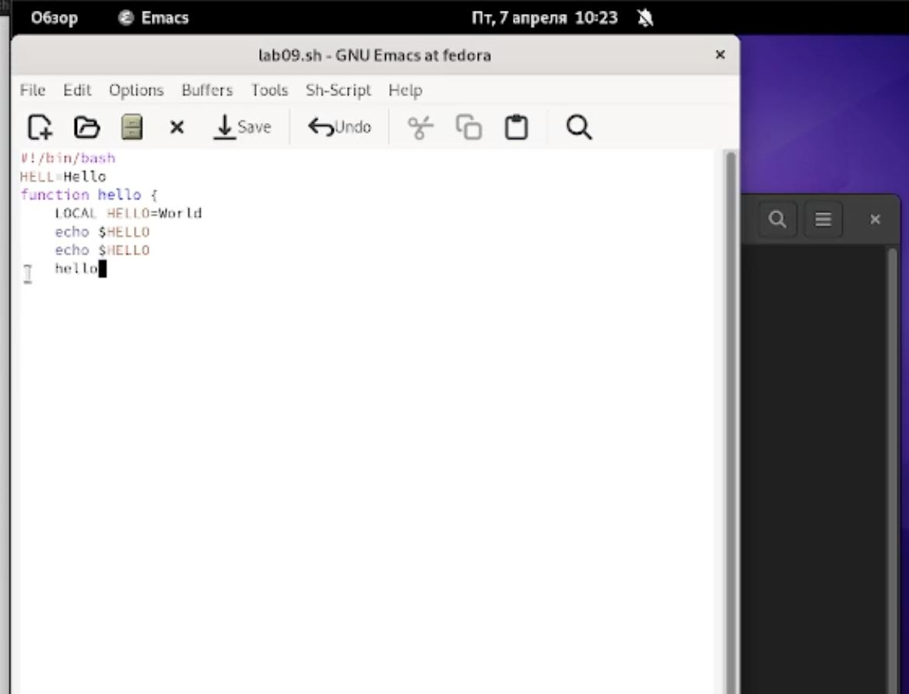
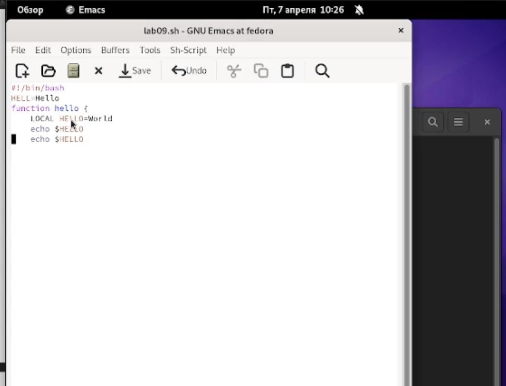
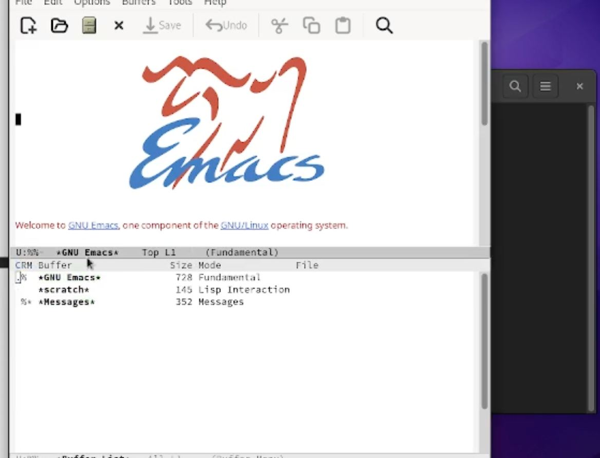
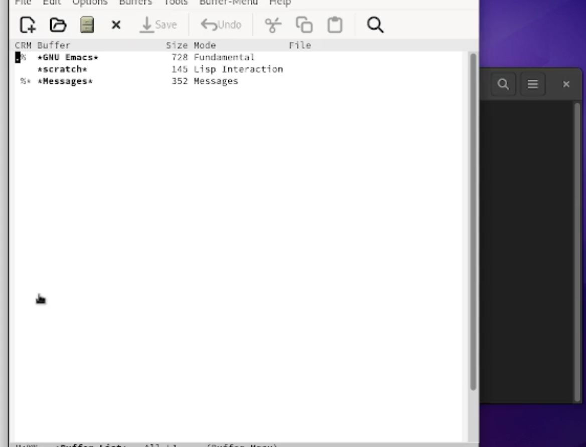
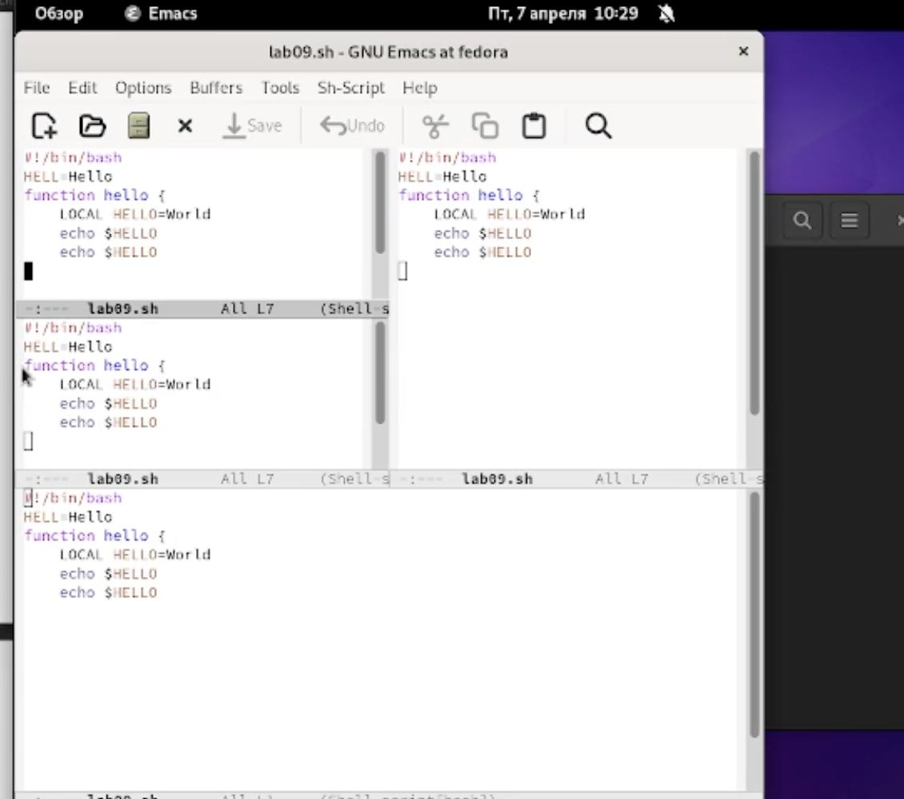
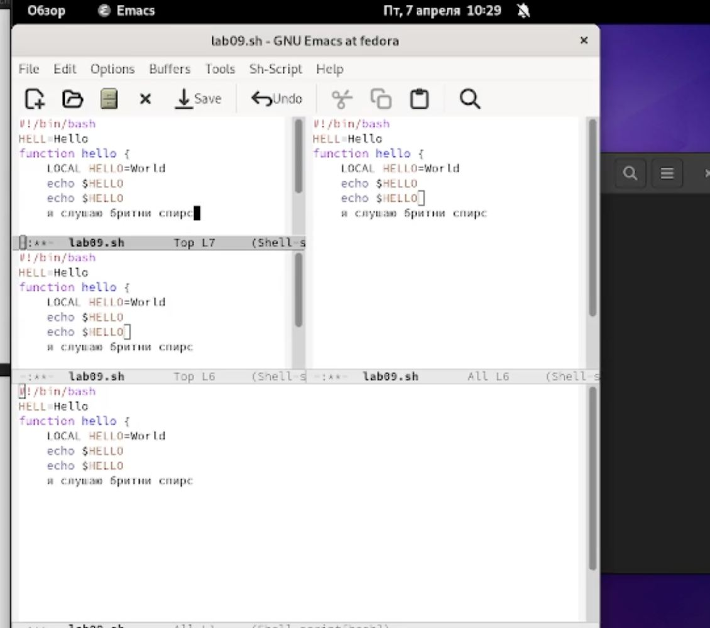
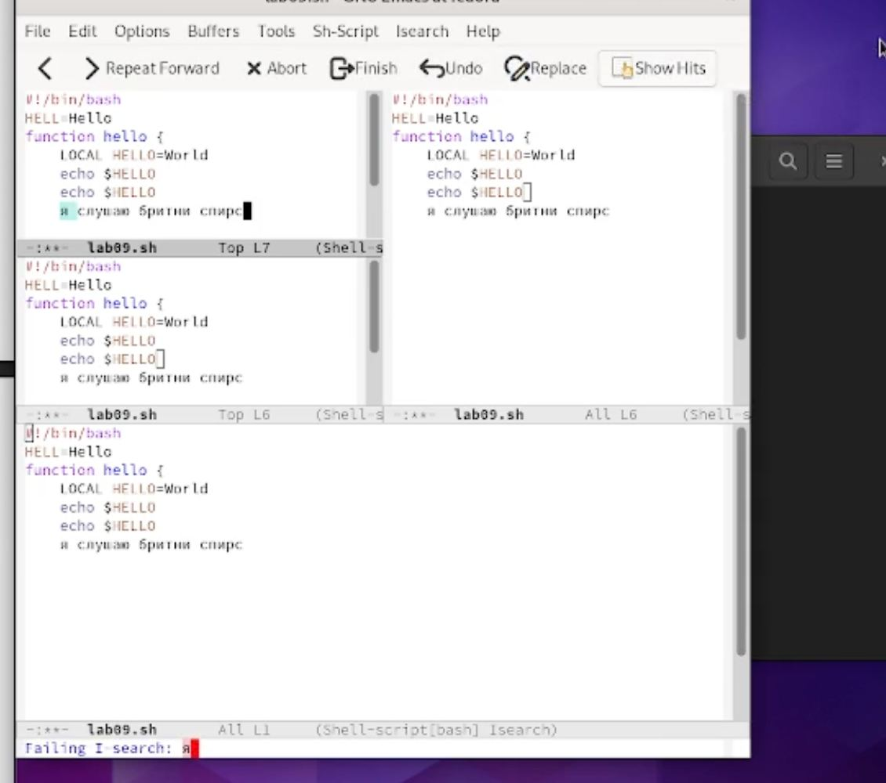

---
## Front matter
title: "Отчет по лабораторной работе №9"
subtitle: "Операционные системы"
author: "Лукина Ирина"

## Generic otions
lang: ru-RU
toc-title: "Содержание"

## Bibliography
bibliography: bib/cite.bib
csl: pandoc/csl/gost-r-7-0-5-2008-numeric.csl

## Pdf output format
toc: true # Table of contents
toc-depth: 2
lof: true # List of figures
lot: true # List of tables
fontsize: 12pt
linestretch: 1.5
papersize: a4
documentclass: scrreprt
## I18n polyglossia
polyglossia-lang:
  name: russian
  options:
	- spelling=modern
	- babelshorthands=true
polyglossia-otherlangs:
  name: english
## I18n babel
babel-lang: russian
babel-otherlangs: english
## Fonts
mainfont: PT Serif
romanfont: PT Serif
sansfont: PT Sans
monofont: PT Mono
mainfontoptions: Ligatures=TeX
romanfontoptions: Ligatures=TeX
sansfontoptions: Ligatures=TeX,Scale=MatchLowercase
monofontoptions: Scale=MatchLowercase,Scale=0.9
## Biblatex
biblatex: true
biblio-style: "gost-numeric"
biblatexoptions:
  - parentracker=true
  - backend=biber
  - hyperref=auto
  - language=auto
  - autolang=other*
  - citestyle=gost-numeric
## Pandoc-crossref LaTeX customization
figureTitle: "Рис."
tableTitle: "Таблица"
listingTitle: "Листинг"
lofTitle: "Список иллюстраций"
lotTitle: "Список таблиц"
lolTitle: "Листинги"
## Misc options
indent: true
header-includes:
  - \usepackage{indentfirst}
  - \usepackage{float} # keep figures where there are in the text
  - \floatplacement{figure}{H} # keep figures where there are in the text
---

# Цель работы

Познакомиться с операционной системой Linux. Получить практические навыки работы с редактором Emacs.

# Выполнение лабораторной работы

1. Открываю текстовый редактор (предварительно установив на свою ВМ).

{#fig:001 width=70%}

2. Создаю файл lab09.sh с помощью комбинации  Cx Cf.

{#fig:002 width=70%}

3. Набираю текст и сохраняю его.

{#fig:003 width=70%}

4. Проделываю с текстом процедуры редактирования: 
 а) вырезание и вставка строки
 б) выделение области текста
 в) копирование
 г) перемещение курсора и тд.
 
 {#fig:004 width=70%}
 
 {#fig:005 width=70%}
 
 {#fig:006 width=70%}
 
 5. Перехожу к управлению буферами:
 а) вывожу список активных буферов
 {#fig:007 width=70%}
 
 б)переключение на другой буфер
 {#fig:008 width=70%}
 
 9. Управление окнами. Делю фрейм на 4 части и ввожу текст.
 
 {#fig:009 width=70%}
 
 {#fig:010 width=70%}
 
 10. Перехожу в режим поиска и ищу некоторые слова
 
 {#fig:011 width=70%}
 
 11. Пробую другие режимы поиска.
 
 
# Выводы

В ходе выполнения работы я приобрела практические навыки работы с текстовым редактором Emacs.

# Список литературы{.unnumbered}

::: {#refs}
:::
