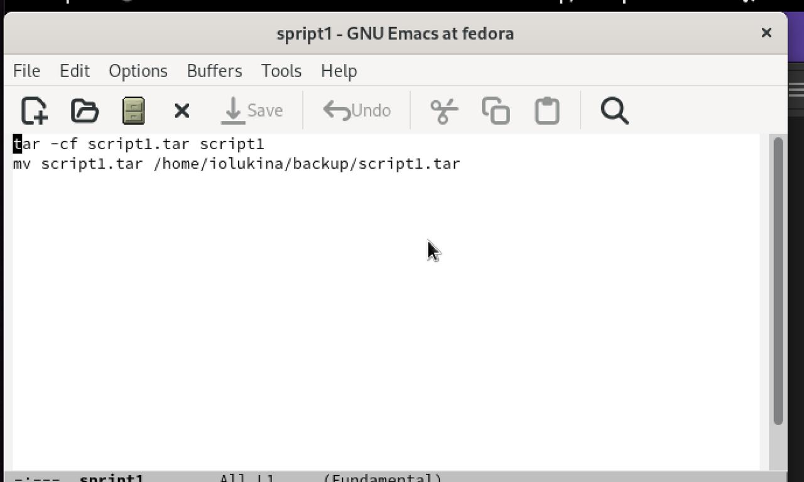
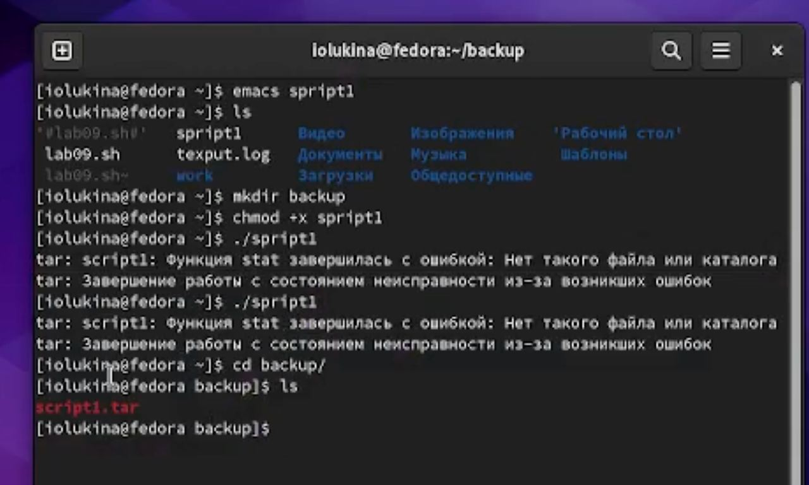
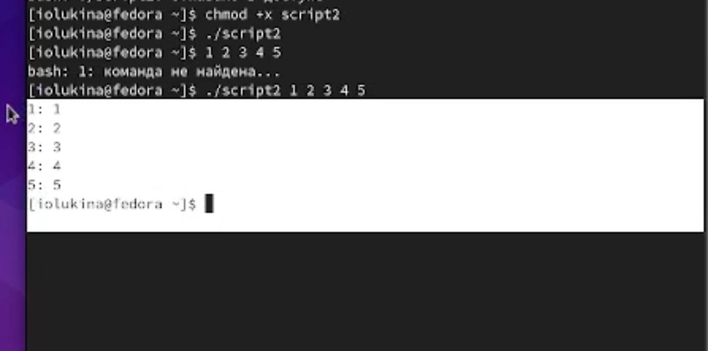
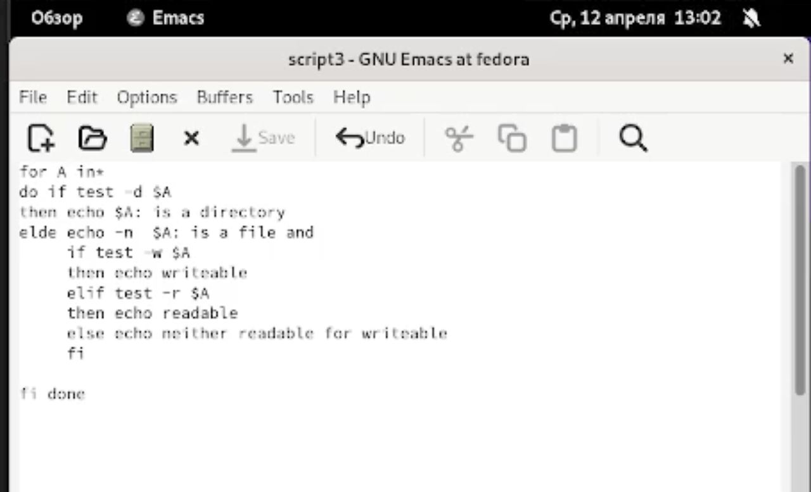
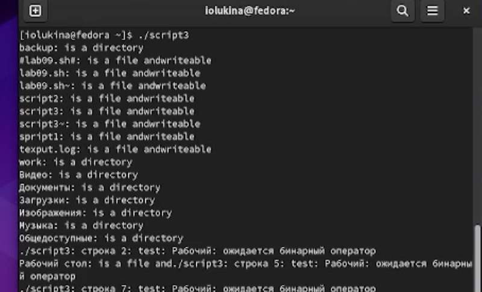
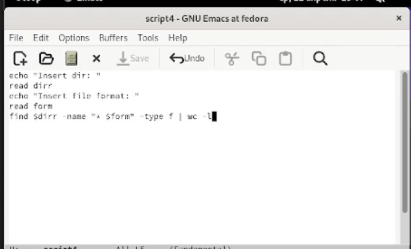
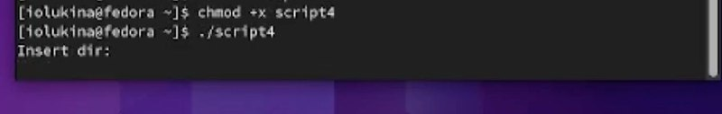

---
## Front matter
lang: ru-RU
title: Отчет по лабораторной работе №10
subtitle: Операционные системы
author:
  - Лукина Р.О.
institute:
  - Российский университет дружбы народов, Москва, Россия
date: 12 апреля 2023

## i18n babel
babel-lang: russian
babel-otherlangs: english

## Formatting pdf
toc: false
toc-title: Содержание
slide_level: 2
aspectratio: 169
section-titles: true
theme: metropolis
header-includes:
 - \metroset{progressbar=frametitle,sectionpage=progressbar,numbering=fraction}
 - '\makeatletter'
 - '\beamer@ignorenonframefalse'
 - '\makeatother'
---

# Информация

## Докладчица

:::::::::::::: {.columns align=center}
::: {.column width="70%"}

  * Лукина Рина
  * студентка НБИ-04-22

:::
::: {.column width="30%"}

:::
::::::::::::::

# Введение

## Цель работы

- Создать шаблон презентации в Markdown
- Описать алгоритм создания выходных форматов презентаций

# Выполнение работы

## Скрипт для создания резервной копии

- Пишу скрипт для работы резервной копии

## Скрипт для создания резервной копии

## Скрипт для обработки чисел

- Создаю скрипт и проверяю его работу

## Скрипт аналог команды ls

- Создаю скрипт, который будет выявлять информацию о нужном каталоге в определенной директории

## Скрипт аналог команды ls

## Скрипт командный файл

- Пишу скрипт и проверяю работу

## Скрипт командный файл

## Выводы

- В ходе работы я написала 4 скрипта и поняла принцип их создания.

