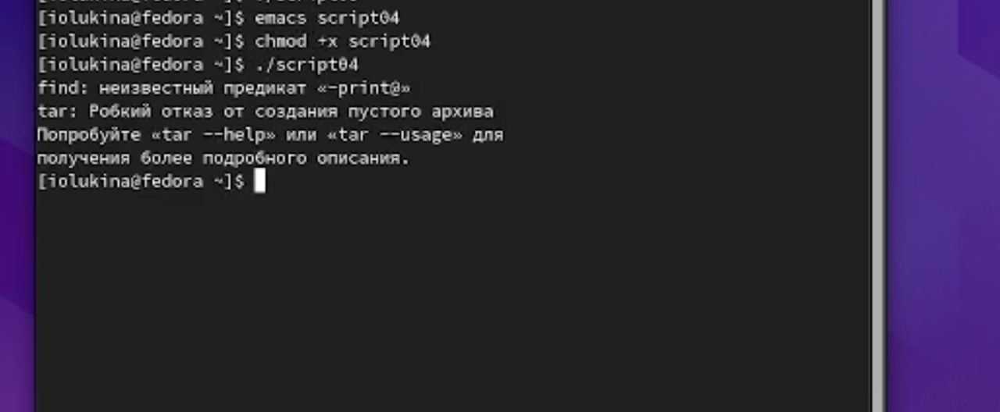

---
## Front matter
lang: ru-RU
title: Отчет по лабораторной работе №11
subtitle: Операционные системы
author:
  - Лукина Р.О.
institute:
  - Российский университет дружбы народов, Москва, Россия
date: 20 апреля 2023

## i18n babel
babel-lang: russian
babel-otherlangs: english

## Formatting pdf
toc: false
toc-title: Содержание
slide_level: 2
aspectratio: 169
section-titles: true
theme: metropolis
header-includes:
 - \metroset{progressbar=frametitle,sectionpage=progressbar,numbering=fraction}
 - '\makeatletter'
 - '\beamer@ignorenonframefalse'
 - '\makeatother'
---

# Информация

## Докладчица

:::::::::::::: {.columns align=center}
::: {.column width="70%"}

  * Лукина Ирина
  * студентка НБИ-04-22

:::
::: {.column width="30%"}

:::
::::::::::::::

# Вводная часть

## Цель работы

- Научиться писать командные файлы

# Ход работы

## Первый файл

- Пишу первый скрипт

## Первый файл

## Второй файл
- Скрипт второго командного файла

## Второй файл

## Третий файл

- Пишу скрипт третьей программы

## Третий файл

## Четвертый файл

- Пишу скрипт для 4 программы

## Четвертый файл

# Выводы

В ходе выполнения работы я научилась писать командные файлы
