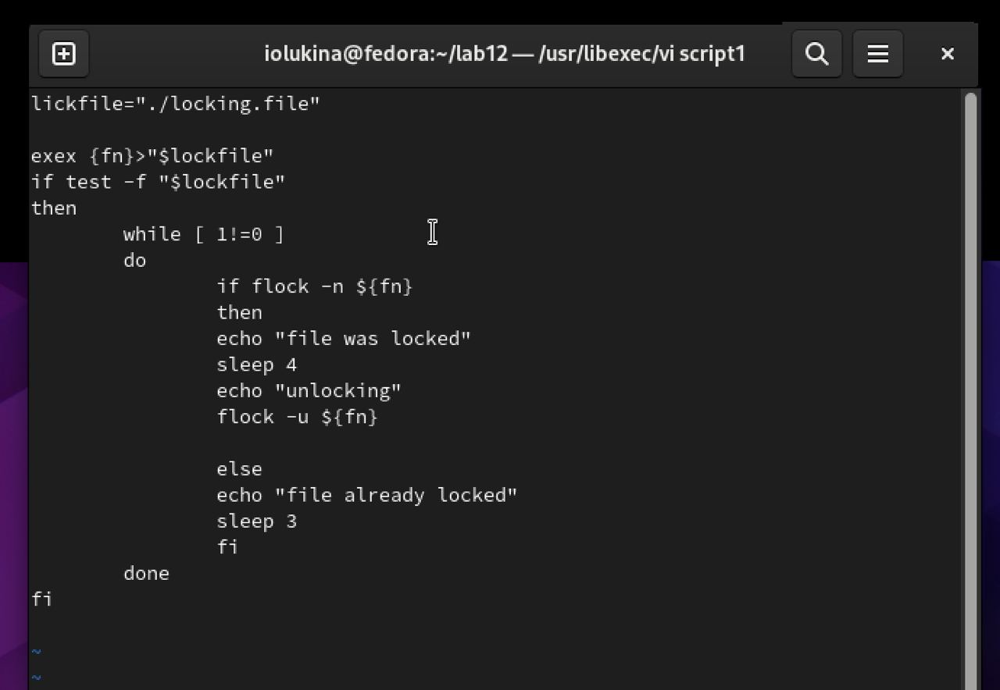
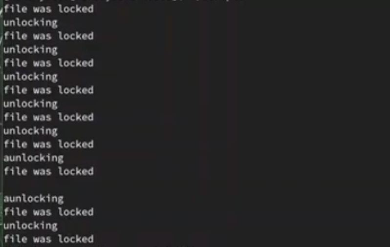
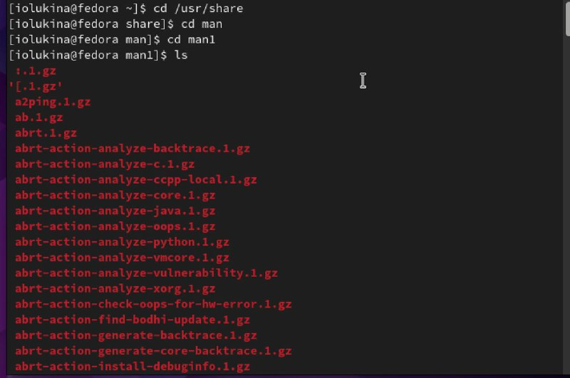
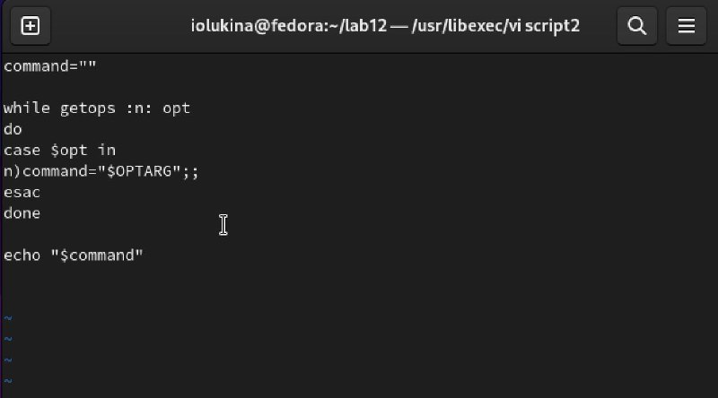
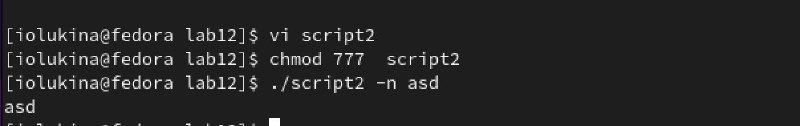
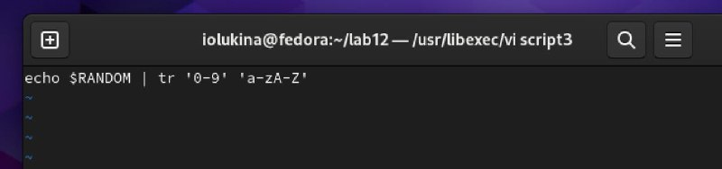
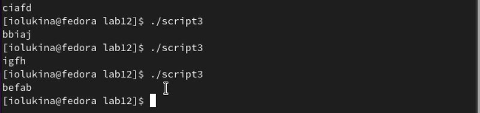

---
## Front matter
lang: ru-RU
title: Отчет по лабораторной работе №12
subtitle: Операционные системы
author:
  - Лукина Р.О.
institute:
  - Российский университет дружбы народов, Москва, Россия
date: 27 апреля 2023

## i18n babel
babel-lang: russian
babel-otherlangs: english

## Formatting pdf
toc: false
toc-title: Содержание
slide_level: 2
aspectratio: 169
section-titles: true
theme: metropolis
header-includes:
 - \metroset{progressbar=frametitle,sectionpage=progressbar,numbering=fraction}
 - '\makeatletter'
 - '\beamer@ignorenonframefalse'
 - '\makeatother'
---

# Информация

## Докладчица

:::::::::::::: {.columns align=center}
::: {.column width="70%"}

  * Лукина Ирина Олеговна
  * студентка НБИ-04-22

# Вводная часть

## Цели и задачи

- Освоить программирование внутри оболочки  системы Линукс 

# Ход работы

## Упрощенный механизм семафоров

- Создаю командный файл и проверяю его работу в терминале

## Упрощенный механизм семафоров

## Командный файл 2

- Проверяю каталог, создаю код и проверяю работу

- Использование LaTeX
- Пакет для презентации: [beamer](https://ctan.org/pkg/beamer)
- Тема оформления: `metropolis`

## Командный файл 2

## Командный файл 2

## Случайная генерация латинских букв

- Пишу код, который будет генерировать случайную последовательность букв алфавита при каждом запуске

## Случайная генерация латинских букв

## Результаты

- В ходе работы я приобрела практические навыки работы в системе Линукс

