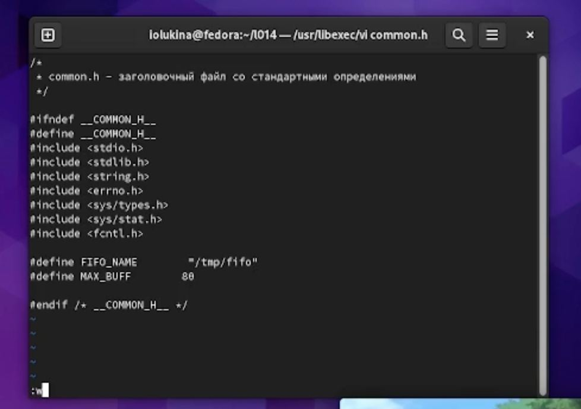
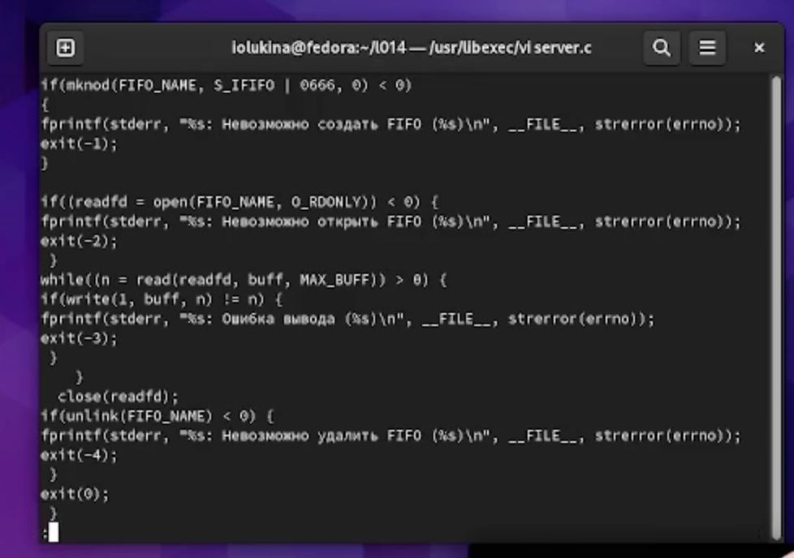
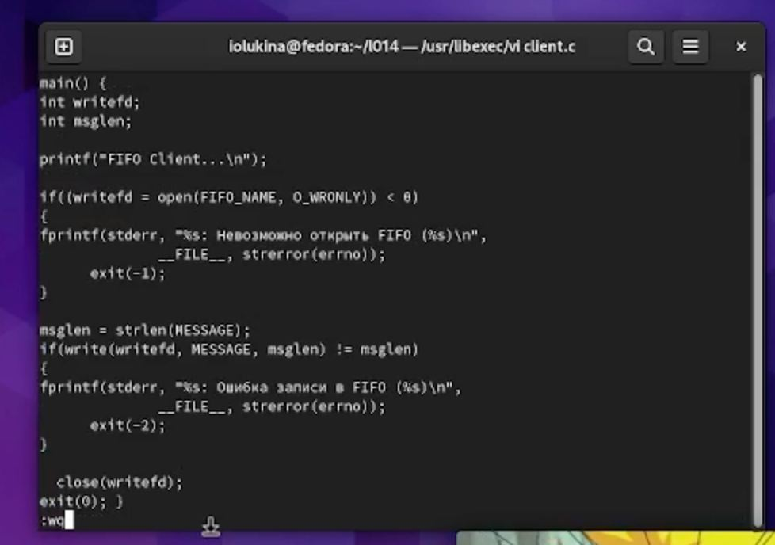
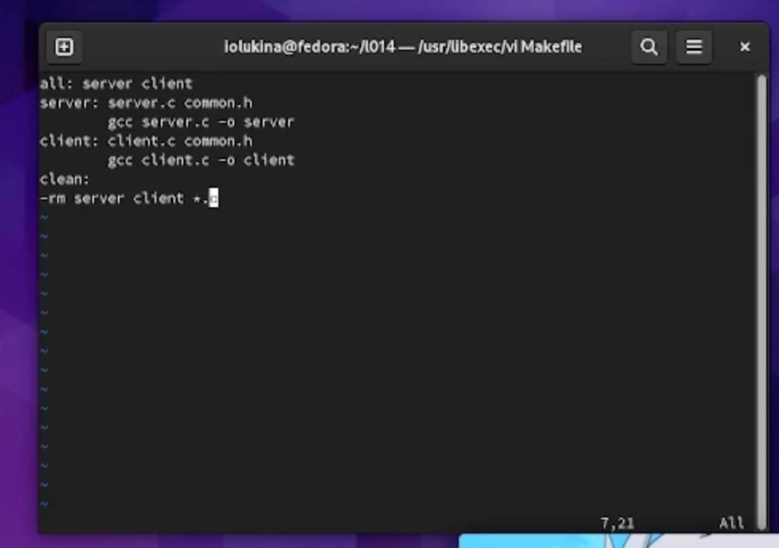
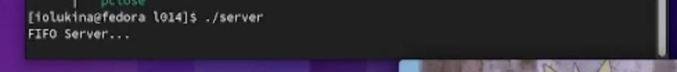

---
## Front matter
lang: ru-RU
title: Отчет по лабораторной работе №14
subtitle: Операционные системы
author:
  - лукина р.о.
institute:
  - Российский университет дружбы народов, Москва, Россия
date: 13 мая 2023

## i18n babel
babel-lang: russian
babel-otherlangs: english

## Formatting pdf
toc: false
toc-title: Содержание
slide_level: 2
aspectratio: 169
section-titles: true
theme: metropolis
header-includes:
 - \metroset{progressbar=frametitle,sectionpage=progressbar,numbering=fraction}
 - '\makeatletter'
 - '\beamer@ignorenonframefalse'
 - '\makeatother'
---

# Информация

## Докладчица

:::::::::::::: {.columns align=center}
::: {.column width="70%"}

  * Лукина Рина
  * студентка НБИ-04-22

:::
::: {.column width="30%"}

:::
::::::::::::::

# Введение

## Цель

- Научиться работать с именованными каналами

# Ход работы

## Файл common.h

- В созданном рабочем пространстве пишу код

## Файл server.c

- В новом файле пишу новый код

## Файл client.c

- Пишу новый скрипт в созданном файле

## Файл Makefile

- В новом файле пишу скрипт

## Результат

- Вызываю ./server и проверяю работу скрипта

# Выводы
- В ходе выполнения работы я научилась работать с именованными каналами.

