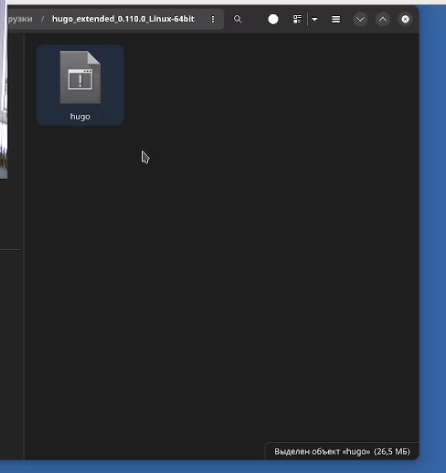
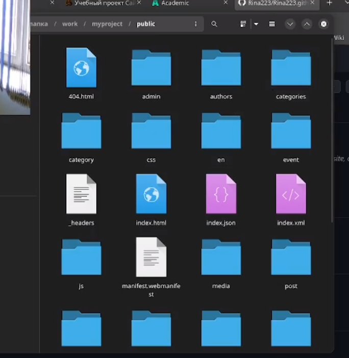

---
## Front matter
title: "Отчет первого этапа идндивидуального проекта"
subtitle: "Операционные системы"
author: "Лукина Ирина"

## Generic otions
lang: ru-RU
toc-title: "Содержание"

## Bibliography
bibliography: bib/cite.bib
csl: pandoc/csl/gost-r-7-0-5-2008-numeric.csl

## Pdf output format
toc: true # Table of contents
toc-depth: 2
lof: true # List of figures
lot: true # List of tables
fontsize: 12pt
linestretch: 1.5
papersize: a4
documentclass: scrreprt
## I18n polyglossia
polyglossia-lang:
  name: russian
  options:
	- spelling=modern
	- babelshorthands=true
polyglossia-otherlangs:
  name: english
## I18n babel
babel-lang: russian
babel-otherlangs: english
## Fonts
mainfont: PT Serif
romanfont: PT Serif
sansfont: PT Sans
monofont: PT Mono
mainfontoptions: Ligatures=TeX
romanfontoptions: Ligatures=TeX
sansfontoptions: Ligatures=TeX,Scale=MatchLowercase
monofontoptions: Scale=MatchLowercase,Scale=0.9
## Biblatex
biblatex: true
biblio-style: "gost-numeric"
biblatexoptions:
  - parentracker=true
  - backend=biber
  - hyperref=auto
  - language=auto
  - autolang=other*
  - citestyle=gost-numeric
## Pandoc-crossref LaTeX customization
figureTitle: "Рис."
tableTitle: "Таблица"
listingTitle: "Листинг"
lofTitle: "Список иллюстраций"
lotTitle: "Список таблиц"
lolTitle: "Листинги"
## Misc options
indent: true
header-includes:
  - \usepackage{indentfirst}
  - \usepackage{float} # keep figures where there are in the text
  - \floatplacement{figure}{H} # keep figures where there are in the text
---

# Цель работы

Целью работы является научиться создавать сайт с помощью hugo через терминал, платформу github и готовый шаблон

# Выполнение лабораторной работы

1. Из указанного репозитория скачиваю новейшую версию hugo. Извлекаю архив в загрузки 

{#fig:001 width=90%}

2. Файл hugo копирую, затем в домашней папке создаю bin и вставляю файл в нее

{#fig:002 width=90%}

{#fig:003 width=90%}

3. Создаю новый репозиторий со свободным названием на основе уже имеющегося репозитория. Клонирую его через git clone 

{#fig:004 width=90%}

{#fig:005 width=90%}

4. Перехожу в созданный каталог будущего проекта, проверяю его составляющие. 

{#fig:006 width=90%}

5. Выполняю bin hugo и проверю его. В нем есть каталог public, который нужно удалить. Делаю это через mc.

{#fig:007 width=90%}

{#fig:008 width=90%}

{#fig:009 width=90%}

6. Выполняю bin hugo server. Эта команда даст ссылку на шаблон сайта, который буду использовать. Перехожу по ней.

{#fig:010 width=90%}

{#fig:011 width=90%}
7. Теперь нужно создать новый репозиторий, имя которого должно быть определенным. Клонирую его.

{#fig:012 width=90%} 

{#fig:013 width=90%}

8. Перехожу в созданный каталог и создаю ветку main.

{#fig:015 width=90%}

9. Создаю новый файл, отправляю на сервер и проверяю репозиторий.

{#fig:016 width=90%}

{#fig:017 width=90%}

10. В своем каталоге привязываю public к своей ветке. С первого раза это не получится.

{#fig:018 width=90%}

11. Чтобы исправить ошибку, через mc комментирую public в файле .gitignore. Затем сохранение проверяю в терминале. После этого повторяю команду submodule.

{#fig:019 width=90%}

{#fig:020 width=90%}

12. Выполняю bin/hugo/

{#fig:021 width=90%}

{#fig:022 width=90%}

13. Выполняю git remote и добавляю файлы на сервер.

{#fig:023 width=90%}

{#fig:024 width=90%}

14. Обновляю репозиторий, копирую ссылку и перехожу н сайт. Получился шаблон, который в будущем я буду преобразовывать.

{#fig:025 width=90%}

{#fig:026 width=90%}

# Выводы

По окончании выполнения первого этапа я научилась базовым настройкам и работе с шаблоном сайта с помощью hugo и платформы github.

::: {#refs}
:::
